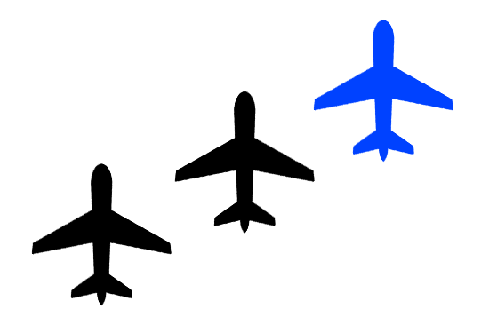

--8<-- "includes/abbreviations.md"

## Flight Plan Submission
A single flight plan should be submitted for the formation, with the formation callsign as the listed callsign. 

The VATSIM flight plan prefile system doesn't include a field for number of aircraft, so this should be included in the remarks.

!!! example
    A formation of three aircraft utilising the callsign **Champ Formation** would as below:  
    
    Callsign: `CHAMP`  
    Remarks: `RMK/FLIGHT OF THREE`

## Flying in Formation
Pilots in formation should have a clear picture of their role and who their lead aircraft is. Wingmen should focus solely on maintaining their position in the formation, allowing lead to make all navigational and operational decisions.

### Radio Communication
The lead aircraft should make all radio calls, with all wingmen listening in. The lead should also be the only aircraft with their transponder on, with all other aircraft in STBY or OFF.

When a frequency change is desired, the lead aircraft shall instruct their wingmen to switch to the new frequency. After a sufficient pause, each aircraft should briefly broadcast on the frequency to inform the lead that they have made the change. Once all wingmen have checked in, the lead aircraft can contact the ATS unit on behalf of the formation.

!!! example
    **SAS**: "CHAMP, contact Melbourne Centre on 125.0"  
    **CHAMP1**: "CHAMP push 125.0"  

    **CHAMP1**: "1"  
    **CHAMP2**: "2"  
    **CHAMP3**: "3"  
    **CHAMP1**: "Melbourne Centre, CHAMP formation, maintaining A090"

## Formation Types
A number of formation configurations are available. Pilots are free to choose the layout which works best for their intended flight.

### Vic
All aircraft form up on either side of the lead aircraft, staggered backwards in a large inverse **V** shape.

<figure markdown> 
{ width="600" }
</figure>

### Echelon
All aircraft form up on either the left or right side of the lead aircraft, staggered backwards at a roughly 45° angle.

<figure markdown> 
{ width="600" }
</figure>

### Line Abreast
All aircraft form up alongside the lead aircraft, with each wing aligned with the wing of the adjacent aircraft.

<figure markdown> 
{ width="600" }
</figure>

### Line Astern
All aircraft form up behind the aircraft ahead, forming a single line behind the lead aircraft.

<figure markdown> 

</figure>