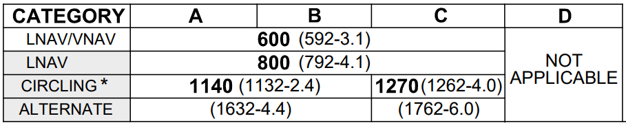

--8<-- "includes/abbreviations.md"

## Transition Layer
The **transition layer** is a variable band of levels which separate the altitudes where a pilot should set their altimeter to QNH and the flight levels where the standard altimeter setting should be used. The bottom of the layer is bordered by the **transition altitude** and the top of the layer is bordered by the **transition level**.

As pilots climb through the transition altitude, they should set their altimeters to the standard altimeter setting of 1013 hPa. Modern avionics generally provide a *STD* function to facilitate this. As pilots descend through the transition level, they should set their altimeters to the most appropriate QNH setting (generally their destination aerodrome QNH, or [area QNH](#area-qnh) if local QNH is not available).

### Cruise Level Availability
Cruising at a level inside the transition layer is not permitted.

In Australia, the transition altitude is fixed at 10,000ft AMSL. The transition level varies with QNH, as per below:

| Flight Level | Availability |
| --- | --- |
| FL110 | Not available when QNH is below 1013 hPa |
| FL115 | Not available when QNH is below 997 hPa |
| FL120 | Not available when QNH is below 980 hPa |
| FL125 | Not available when QNH is below 963 hPa |

As a result, levels up to F125 may not always be available for aircraft to cruise at.

!!! example
    The area QNH is 991 hPa. As a result, the transition layer extends between A100 and F120, and levels between them are not available for cruising.

## Area QNH
Area QNH is a forecast QNH value covering a wide geographical area. A number of area QNH zones are published (visible on the PCA) with forecast QNH values published for each. Where large pressure gradients create varying QNH in a zone, it is subdivided so that the published area QNH value is always no more than 5 hPa difference from neighbouring area QNH or local QNH values.

Area QNH values can be obtained from the [BOM website](http://www.bom.gov.au/aviation/forecasts/area-qnh/){ target=new } or requested from ATS.

!!! example
    **TEK**: "Melbourne Centre, TEK is 15nm southeast of YGTH, request area QNH"  
    **MUN**: "TEK, area QNH 1024"  
    **TEK**: "Area QNH 1024, TEK"

## Altimeter Setting on the Ground
On the ground, local QNH should be set with reference to the ATIS or AWIS. At landing areas without any published weather information, the QNH can be determined by adjusting the altimeter subscale until the instrument reads the current elevation.

## Instrument Approach Corrections
The minima published on most Airservices Australia instrument approach charts assumes the use of forecast QNH from the aerodrome's TAF. This caters for the unlikely situation where a pilot finds themselves unable to obtain actual weather information while inbound to land. However, in the vast majority of cases, this weather information is available, so the minima must be corrected.

For charts with **grey, shaded minima boxes**, the quoted minima altitude should be reduced by **100ft** when using actual QNH (from an ATIS or AWIS). Major aerodromes (such as YSSY and YMML) assume that actual QNH will always be available, so the minima boxes on those approach charts are *not* shaded, and no correction should be applied.

<figure markdown>
{ width="700" }
    <figcaption>Shaded minima boxes at YMER (example only, not for operational use)</figcaption>
</figure>

Where both actual QNH and forecast QNH are *not* available, pilots can use **area QNH** to set their altimeters for the approach. In this case, a correction of **50ft** must be **added** to the shaded boxes (or 150ft added to unshaded boxes).