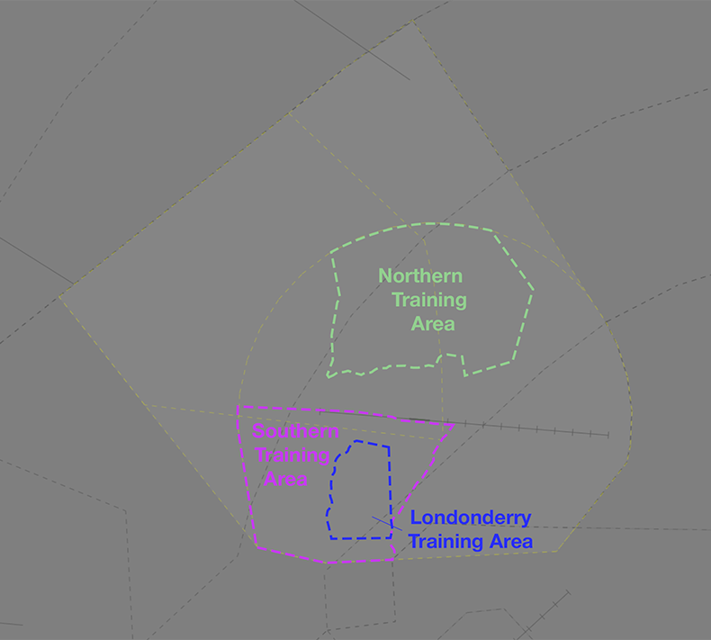

--8<-- "includes/abbreviations.md"

!!! comingsoon "Future Procedure"
    This page documents **future procedures** that are scheduled to be introduced on **09 July 2026**. 
    
    Pilots are strongly encouraged to familiarise themselves with the incoming changes before launch day.

## Airspace
**RI ADC** administers the R479 restricted area when active from `SFC` to `A015`. **SY TCU** administers it from `A015` to `A045`.

### Tower Closed Procedures
When **RI ADC** is not online, R479 from `SFC` to `A045` is reclassified as Class G airspace and administered by **SY TCU**. CTAF procedures apply at YSRI.

## Circuit Operations
The YSRI circuit area is defined as within 6nm of the YSRI ARP. An aircraft operating in the circuit will be issued a clearance to operate not above `A015`. Both runways fly a left hand circuit.

## Departures
VFR aircraft should expect a visual departure on track to their first tracking point.

IFR aircraft should expect to be issued with a SID as per below:

| Aircraft Type | Runway | First Waypoint | SID |
| --- | --- | --- | --- |
| All | All | BEROW or TESAT | BEROW SID |
| All | All | NIVOT | NIVOT SID |
| All | All | RUTOS | RUTOS SID |
| All | All | Tracking W, NW, SW | NESSY SID |
| All | All | All others | RADAR SID |

Aircraft which would otherwise be assigned the RADAR SID may be processed via a visual departure to the north or west, if conditions allow.

## Arrivals
An ILS is available to RWY 28. RNP approaches are available to both runways. An NDB approach is available to RWY 28 and to the circling area.

IFR aircraft can generally expect to be processed via a STAR to the IAF for the following approach:

| Runway | Approach |
| --- | --- |
| RWY 10 | RNP |
| RWY 28 | ILS |

During VMC, IFR aircraft may be processed via a visual approach with a relevant circuit join instruction.

## VFR Procedures
VFR aircraft transiting to/from YSRI should do so at `A015`.

Aircraft intending to transit the RIC CTR should plan via the [Richmond Lane of Entry](#richmond-lane-of-entry).

### Richmond Lane of Entry
A [lane of entry](../../airspace/lanesofentry.md) is available in the western portion of the RIC CTR, allowing aircraft to transit the zone from north to south (or vice versa). A clearance is required from **RI ADC** prior to entering the CTR.

| Direction | Routing | Altitude | Reporting Point |
| --- | --- | --- | --- |
| Northbound | NPBR, then via the powerlines to KRMD, then WSFR | `A015` | KRMD |
| Southbound | WSFR to KRMD, then via the powerlines to NPBR | `A015` | KRMD |

!!! phraseology
    **FWC**: "Richmond Tower, FWC, Cessna 172, 4nm south of NPBR, `A015`, received Bravo, for the lane of entry, request clearance"  
    **RI ADC**: "FWC, squawk 0366, remain outside controlled airspace"  
    **FWC**: "Squawk 0366, remain outside controlled airspace, FWC"  

    **RI ADC**: "FWC, identified, cleared to track via the lane northbound, maintain `A015`"  
    **FWC**: "Cleared to track via the lane northbound, maintain `A015`, FWC"  

Pilots must report their position and estimate for their next waypoint at KRMD.

!!! phraselogy
    **FWC**: "FWC, KRMD, estimating WSFR at time 33"  
    **RI ADC**: "FWC"

Details of the lane are available in the `YSRI ERSA FAC` and on the Sydney VTC.

!!! note
    Expect delays for clearance via the lane of entry during times of peak traffic into/out of YSRI.

### Training Areas
There are three training areas located within R479, used for both civil and military operations.

| Name | Vertical Limits | Lateral Boundary |
| ---- | --------------- | --- |
| Londonderry Training Area | `SFC - A015` | Yarramundi Bridge East to Springwood Road Bonner Road to intersection of Vincent Road West along Vincent Road to the intersection of the Nepean River North via the eastern bank of the Nepean River to Yarramundi Bridge |
| Northern Training Area | `SFC - A060` | Intersection of North-South powerlines & Bells Line of Road North along power lines to the R479 boundary East along the R479 boundary to the Hawkesbury River South tot Kurmond Road West along Kurmond Road to Kurmond Via Bells Line of Road to the intersection of the power lines |
| Southern Training Area | `SFC - A040` | Richmond Train Station West to the water tank Straight line to the R479 boundary Along the R479 boundary to the Northern Road Along Northern Road to the intersection of Richmond/Blacktown Road Richmond Road to George & Macquarie Street to the railway overpass |

<figure markdown>
{ width="700" }
  <figcaption>RI Training Areas</figcaption>
</figure>

!!! tip
    Additional diagrams of the training areas are available in the [Richmond FIHA AD2](https://ais-af.airforce.gov.au/){target=new} document.