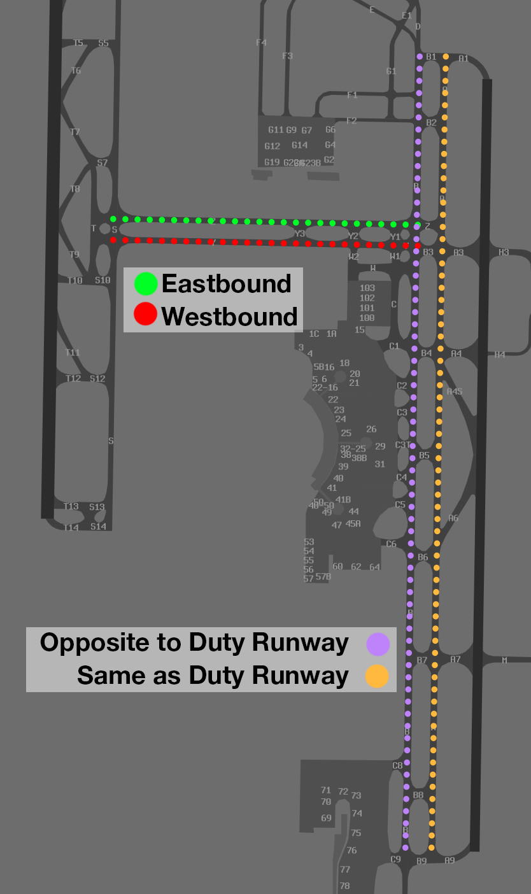

--8<-- "includes/abbreviations.md"

## Taxiing
### Standard Taxi Routes
Standard taxi routes exist to simplify issued taxi instructions. Unless explicit instructions are received, the following taxiways should be used in the directions indicated below:

| Taxiway | Direction of Travel |
| ------- | ------------------- |
| Bravo | Opposite to Duty Runway |
| Alpha | Same Direction as Duty Runway |
| Yankee | Westbound |
| Zulu | Eastbound |

<figure markdown>
{ width="450" }
    <figcaption>Brisbane Standard Taxi Routes</figcaption>
</figure>

!!! warning "Important"
    SMC may provide instructions which contradict these standard taxi routes. Ensure you comply with any issued taxi instruction at all times.

#### SMC Frequency Change
Three SMC positions exist at Brisbane, all with different jurisdiction. Aircraft shall expect to hold short of predetermined taxiways. Domestic aircraft should independently transfer to the next SMC controller autonomously, while international aircraft may expect an explicit frequency change from the current SMC.

## Departures
VFR aircraft should expect to depart via a visual departure, on track to their first tracking point.

IFR aircraft should expect to be issued with a SID as per below:

| Aircraft Type | Runway | First Waypoint | SID |
| --- | --- | --- | --- |
| Jets | All | BIXAD | BIXAD SID |
| Jets | RWY 01R or 19L | SANEG | SANEG SID |
| Jets | RWY 01R or 19L | SCOTT | SCOTT SID |
| Jets | RWY 01R or 19L | GUMKI | GUMKI SID |
| Jets | RWY 01R, 19L, or 19R | WACKO | WACKO SID |

All other aircraft shall expect the **BN (RADAR) SID**.

### Pushback/Taxi on ACD
Dring periods of peak traffic, special procedures are activated requiring pilots to contact ACD, who assesses the current aerodrome traffic levels, before they are transferred to the SMC frequency.

When the ATIS includes `ALL DEPARTURES MUST REQUEST PUSH BACK ON 118.85`, all pilots must contact ACD when ready for pushback or taxi (if no pushback is required).

!!! phraseology
    **QFA291:** "Brisbane Delivery, QFA291, bay 32, request pushback"  
    **BN ACD:** "QFA291, estimated delay 10 minutes, remain this frequency."  
    **QFA291**: "Remain this frequency, QFA291"  

When instructed, pilots must switch to SMC and **monitor** the frequency. **Do not contact SMC**, they will call you.

!!! phraseology
    **BN ACD**: "QFA291, standby for ground, 121.7"  
    **QFA291**: "Standby for ground, 121.7, QFA291"  

    *Pilot switches to 121.7 and <strong>waits for the controller to contact them</strong>.*

    **BN SMC**: "QFA291, pushback approved"  
    **QFA291**: "Pushback approved, QFA291"

There may be a delay on the SMC frequency before the controller contacts you. Pilots should only initiate contact with SMC if a significant amount of time (over 10 min) has passed since the frequency transfer and no contact has been made by the controller.

## Arrivals
ILS, RNP, and RNP(AR) approaches are available to all runways. 

IFR aircraft can generally expect to be processed via a STAR terminating with the following approach:

| Runway | Approach |
| --- | --- |
| RWY 01L | ILS |
| RWY 01R | ILS |
| RWY 19L | ILS or RNP(AR) |
| RWY 19R | ILS |

### Preferred Runway Exits
The `AIRPORT EFFICIENCY PROCEDURES` chart dictates preferred runway exits for pilots to vacate at. This ensures a predictable, efficient movement of aircraft on the aerodrome and should be abided by where possible. Where a preferred exit is not assured, pilots must inform ADC.

| Runway | Aircraft Type | Preferred Exits |
| --- | --- | --- |
| RWY 01L | Turboprop Jet Heavy Jet | T8 T6 T4 |
| RWY 01R | Turboprop, Jet Heavy Jet | A4S A4 or A3 |
| RWY 19L | Turboprop, Jet Heavy Jet | A6 A7 |
| RWY 19R | Turboprop Jet Heavy Jet | T7 T9  T11 |

### Rerouting
Some aircraft from the north, south, or west may be rerouted via the adjacent STAR for traffic management. Pilots should be aware of the following waypoints and expect possible tracking as per the table below.

| Inbound Direction | Amended STAR | Possible Routing |
| --- | --- | --- |
| North | MORBI STAR | DCT MORBI |
| North | SMOKA STAR | DCT SMOKA |
| South/West | ENLIP STAR | DCT ENLIP |
| West | BLAKA STAR | DCT BLAKA |

### Predictable Sequencing Waypoints
ATS may utilise [predictable sequencing waypoints](../../airspace/cta.md#predictable-sequencing-waypoints) to tactically delay aircraft inbound via **H66** and **H252**. Pilots should be aware of the following waypoints and expect possible tracking as per the table below.

=== "H66"
    | Initial Waypoint | New Waypoint | Final Waypoint | Delay (in mins) |
    | ---------------- | ------------ | -------------- | --------------- |
    | ADKEK | GUTBI | WHITI | 2 |
    | ADKEK | ISDAG | WHITI | 3 |
    | ADKEK | RULGU | WHITI | 5 |
    | ADKEK | DOVIP | WHITI | 7 |
    | ADKEK | URBAM | WHITI | 9 |
    | ADKEK | ESMIS | WHITI | 11 |
    | ADKEK | UBKEM | WHITI | 13 |

=== "H252"
    | Initial Waypoint | New Waypoint | Final Waypoint | Delay (in mins) |
    | ---------------- | ------------ | -------------- | --------------- |
    | RULGU | DOVIP | OMKAK  | 1 |
    | RULGU | ISDAG | OMKAK  | 2 |
    | RULGU | URBAM | OMKAK  | 3 |
    | RULGU | GUTBI | OMKAK | 4 |
    | RULGU | ESMIS | OMKAK | 5 |
    | RULGU | UBKEM | OMKAK | 7 |
    | RULGU | ADKEK | OMKAK | 8 |
    | RULGU | OTBOL | OMKAK | 11 |

## Helicopter Operations
### Waypoints
In VMC, all helicopters shall expect to be processed via two visual waypoints (outlined below) positioned north and south of the field. Where VMC does not exist, IFR helicopters will conform to fixed wing ops and expect to be processed via the BN (RADAR) SID from an appropriate runway.

| Direction of Flight  | Inbound/Outbound Tracking Point |
| ------------------ | -------------- |
| North      | BLHS   |
| South      | MBHM   |
| East      | MBHM   |
| West      | BLHS   |

!!! phraseology
    **RSCU533:** "Brisbane Delivery, helicopter RSCU533, MEDEVAC, for YXHE, request clearance"  
    **BN ACD:** "RSCU533, Brisbane Delivery, cleared to YXHE via amended BLHS, YXHE, climb to `A025`, squawk 1256, departure frequency 124.7"  
    **RSCU533:** "Cleared to YXHE via amended BLHS, YXHE, climb to `A025`, squawk 1256, departures 124.7, RSCU533"

### Departures
Both taxiways **H2** and **F4** are inside the manoeuvring area and treated like a runway, requiring a takeoff and landing clearance from BN ADC. Helicopters departing on other surfaces outside the manoeuvring areas will be instructed to *"report airborne"*. 

!!! phraseology
    **RSCU533:** "Brisbane Tower, helicopter RSCU533, Taxiway H2 ready"  
    **BN ADC:** "RSCU533, Brisbane Tower, Taxiway H2 cleared for takeoff"  
    **RSCU533:** "Taxiway H2 cleared for takeoff, RSCU533"
 
    **BN ADC:** "RSCU533, contact departures"  
    **RSCU533:** "Departures, RSCU533"

### Arrivals
Helicopters arriving to YBBN during VMC shall expect to be cleared by via the [appropriate inbound waypoint](#waypoints), with that waypoint issued as the clearance limit. 

Depending on the current traffic situation, pilots may expect an instruction to hold and/or maintain own separation with any arriving or departing aircraft, If holding is required prior to arrival, helicopters will be instructed to hold at the following positions:

| Inbound Via | Holding Position |
| ----------- | ---------------- |
| BLHS        | Brisbane Entertainment Centre *(3nm northwest of runway 01L/19R)* |
| MBHM        | MBHM             |

!!! phraseology 
    **X6G**: "Brisbane Tower, helicopter X6G, for Taxiway F4"  
    **BN ADC**: "X6G, Brisbane Tower, cancel clearance limit, track to and hold at the Brisbane Entertainment Centre, maintain `A010`"  
    **X6G**: "Cancel clearance limit, track to and hold at the Brisbane Entertainment Centre, maintain `A010`, X6G"

    **BN ADC**: "X6G, report sighting, and able to maintain own separation with, a Qantas 737, 4nm final runway 19R"  
    **X6G**: "Traffic sighted, and we are able to maintain own separation. X6G"  
    **BN ADC**: "X6G, cancel hold, pass behind the 737, maintain own separation, caution wake turbulence, cleared visual approach Taxiway F4"  
    **X6G**: "Cancel hold, pass behind the 737, maintain own separation, cleared visual approach Taxiway F4, X6G"

Both taxiway **H2** and **F4** are inside the manoeuvring area and treated like a runway, requiring a takeoff and landing clearance by BN ADC. Helicopters landing on other surfaces outside the manoeuvring areas will be instructed to *"report on the ground"* so the controller knows when they you no longer active in their airspace.

!!! phraseology
    **BN ADC:** "X6G, Taxiway F4, cleared to land"  
    **X6G:** "Taxiway F4, cleared to land, X6G"

## Scenic Flights
### Brisbane City Scenic
Helicopters conducting scenic flights around the city require access to the Brisbane CTA to operate. These flights typically involve low-level operations inside controlled airspace and in proximity to landmarks within the city area.

Aircraft must track via Class G airspace to UQLD and contact BN TCU prior to reaching UQLD requesting airways clearance. If a clearance cannot be given immediately, aircraft may be instructed to remain clear of Class C airspace.

!!! phraseology 
    **FHK**: "Departures, helicopter FHK, 2 miles south UQLD `A010`, for city scenic, request airways clearance"  
    **BN TCU**: "FHK, Departures, squawk 1562, remain outside Class C airspace"  
    **FHK**: "Squawk 1562, remain OCTA, FHK"  

    **BN TCU**: "FHK, identified, cleared to enter controlled airspace remaining west of SBD, not above `A010`, Brisbane QNH 1026"  
    **FHK**: "Cleared to enter controlled airspace remaining west of SBD, not above `A010`, QNH 1026, FHK"

Due to the close proximity to YBBN, aircraft may be instructed to maintain visual separation with arriving or departing aircraft.

!!! phraseology 
    **BN TCU**: "FHK, report sighting an Embraer E190 departing runway 19R, through `A008` on climb."  
    **FHK**: Traffic in sight, FHK"  
    **BN TCU**: "FHK, maintain own seperation with the E190"  
    **FHK**: "Maintain own seperation, FHK"  

    **BN TCU**: "QFA1864, traffic is a helicopter operating over the CBD not above `A010`, maintaining own separation with you"  
    **QFA1864:** "QFA1864"

Pilots shall report once clear of CTA.

!!! phraseology 
    **FHK**: "FHK, excited the zone"  
    **BN TCU**: "FHK, identification and control service terminated, frequency change approved"  
    **FHK**: "Frequency change approved, FHK"

Aircraft should then transfer to area frequency/advisory frequency.