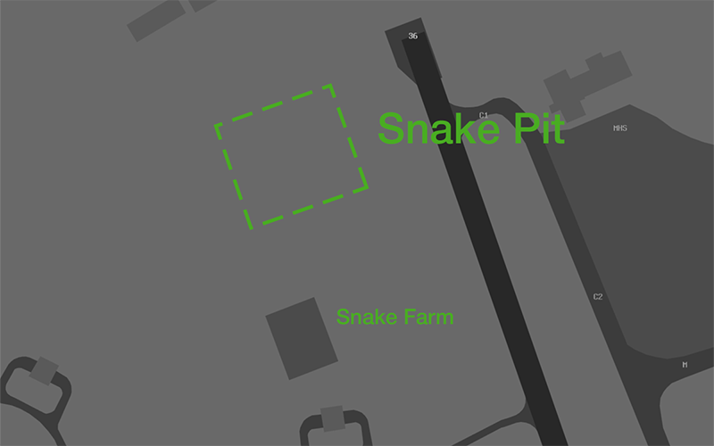

--8<-- "includes/abbreviations.md"

## Departures
VFR aircraft should expect to depart via a published [VFR Route](#vfr-routes). Pilots who have not planned via a VFR route can expect to be rerouted via one.

IFR aircraft should expect to be issued with a SID as per below:

| Aircraft Type | Runway | First Waypoint | SID |
| --- | --- | --- | --- |
| Jets | All | HELLI | HELLI SID |
| Jets | All | JULIE | JULIE SID |
| Jets | All | OCTOB | OCTOB SID |
| Jets | All | RUPEG | RUPEG SID |
| Non-Jets | All | LAKUP | LAKUP SID |
| Non-Jets | All | OLTAS | OLTAS SID |
| Non-Jets | All | RUSKA | RUSKA SID |
| Non-Jets | All | VANDI | VANDI SID |

All other aircraft shall expect the **DN (RADAR) SID**.

## Arrivals
An ILS is available to RWY 29. RNP approaches are available to RWY 11, RWY 29, and RWY 36. RNP(AR) approaches are available to RWY 11 and RWY 29.

IFR aircraft can generally expect to be processed via a STAR (or direct to the IAF) terminating with the following approach:

| Runway | Approach |
| --- | --- |
| 11 | RNP(AR) or RNP-Z if unable |
| 18 | Visual |
| 29 | ILS or RNP(AR) |
| 36 | RNP |

### Initial and Pitch
The intial points are at 5 TAC, aligned with Runway 11 and 29. Aircraft will arrive via a straight initial.

## Circuit Operations
The circuit altitude varies with aircraft type.

| Aircraft | Altitude |
| --- | --- |
| Military Jet | `A020` |
| Other Jet | `A015` |
| Non-Jet | `A010` |
| Helicopter | `A010` |

## Special Use Airspace
### Military Gates
There are several military gates established throughout the SG TMA to facilitate entry and exit to adjoining SUA.

| Intended SUA    | TCU Exit Gate        |
| --------------- | -------------------- |
| M277A-D         | Gates 8-10           |
| M277E-H         | Gates 6-8            |
| M278A           | Gates A-C            |
| M278B-D         | WIZZOS MONNIES    |
| M278E           | Gates C-E            |
| M278F-H         | MONNIES SHAGS     |
| R245            | Gates 1-4            |
| R276A-D         | Gates 4-6            |

!!! note
    Details of each gate can be found in the [Darwin FIHA](https://ais-af.airforce.gov.au/australian-aip).

Pilots should include the desired departure gate when requesting clearance.

!!! phraseology
    *GRFN11 plans to enter the M278A-D MOA via Gate A for military training and airwork.*  
    **GRFN11**: "Darwin Delivery, GRFN11 for Gate A, `A180` for M278A-D, request clearance."  
    **DN ACD**: "GRFN11, Darwin Delivery. Cleared Gate A, LIZAD3 departure. Climb via SID to `A180`, squawk 6001, departure frequency 126.8."
    **GRFN11**: "Cleared Gate A, LIZAD3 departure. Climb via SID to `A180`, squawk 6001, departure frequency 126.8, GRFN11."

## VFR Routes
Details of each VFR route are found on the Darwin VTC. VFR pilots should plan via one of the routes when inbound to or outbound from YPDN.

### Marrara Coded Clearance
VFR aircraft arriving via LPT may be cleared for a visual approach via a **'Marrara Downwind'** clearance. Aircraft that area cleared for a Marrara Downwind must track from LPT towards *Marrara Stadium* before turning to joing a left (Runway 11) or right (Runway 29) downwind.

## Helicopter Operations
VFR helicopters are generally processed via the TALC HEAD Helicopter route. There is both an inbound and outbound route. This route is delivered as a coded clearance designed to separate helicopters from fixed-wing aircraft.  

!!! tip
    Refer to the YPDN ERSA FAC for details of the coded clearance, including implied altitude restrictions.

### Departures
DN ACD will issue airways clearance for all helicopters, including those on a helicopter route.

| Route | Waypoints |
| --- | --- |
| TALC HEAD OUTBOUND | `WOW TCH` |

!!! phraseology
    **QRS:** "Darwin Delivery, helicopter QRS, for the Talc Head outbound, request clearance"  
    **DN ACD:** "QRS, Darwin Delivery, cleared Talc Head outbound, squawk 0215, departure frequency 134.1"  
    **QRS:** "Cleared Talc Head outbound, squawk 0215, departure frequency 134.1, QRS"

### Arrivals
VFR helicopters are generally processed via by the TALC HEAD Inbound route.  IFR helicopters should conform to fixed wing ops and expect to be processed via an appropriate runway.

!!! phraseology
    **QRS:** "Darwin Tower, helicopter QRS, WSM, `A005`, received Tango, request Talc Head Inbound"  
    **DN ADC:** "QRS, Darwin Tower, cleared Talc Head Inbound, report at WOW."  
    **QRS:** "Cleared Talc Head Inbound, QRS"  

### Hospital Helipads
The Darwin CTR contains the helipad at the Royal Darwin Hospital (YXDH). This pad sits outside the manoeuvring area, so no takeoff or landing clearances will be issued. Instead, helicopters will be instructed to report airborne or report on the ground.

### Snake Pit
The **Snake Pit** is an area of dirt adjacent Runway 36 used for low level hover operations, most commonly by military helicopters located at the apron known as the **Snake Farm**, south of OLA 6-10.

<figure markdown>
{ width="700" }
<figcaption>Snake Pit</figcaption>
</figure>

!!! phraseology
    **CHOP19**: "Darwin Tower, helicopter ZXY, Snake Farm, for Snake Pit."   
    **DN ADC**: "CHOP19, Darwin Tower, air transit Snake Pit, cleared to operate Snake Pit, not above 100ft."
	**CHOP19**: "Air transit Snake Pit, cleared to operate Snake Pit, not above 100ft, CHOP19."

## LAHSO
LAHSO is the independent operation of two crossing runways for arrivals and departures. It is a complicated procedure which is rarely used, but occassionally run during VATPAC's busiest events featuring YPDN. Strict pilot requirements apply during LAHSO.

The **active** aircraft is the landing aircraft issued with a hold short instruction, prohibiting them from rolling out on their assigned runway beyond the intersection with the crossing runway.

The **passive** aircraft is the landing or departing aircraft which has full use of their assigned runway.

YPDN operates LAHSO using **RWY 29** as the passive runway and **RWY 36** as the active runway.

### Pilot Requirements
All Australian registered aircraft operating under a flight number callsign are assumed to be **approved active participants**. If a pilot is unable to participate, ATC must be informed no later than 120nm from the destination aerodrome.

!!! phraseology
    **VOZ852**: "VOZ852, negative active LAHSO"  
    **TRT**: "VOZ852"

Other pilots who wish to participate must notify ATC no later than 200nm from the destination aerodrome.

!!! phraseology
    **ANZ1984**: "Brisbane Centre, ANZ1984, maintaining FL360, LAHSO approved"  
    **TRT**: "ANZ1984, Brisbane Centre"

Pilots who are unable to participate actively will be sequenced as a passive aircraft. Pilots who are unable to participate at all will be sequenced for an independent approach.