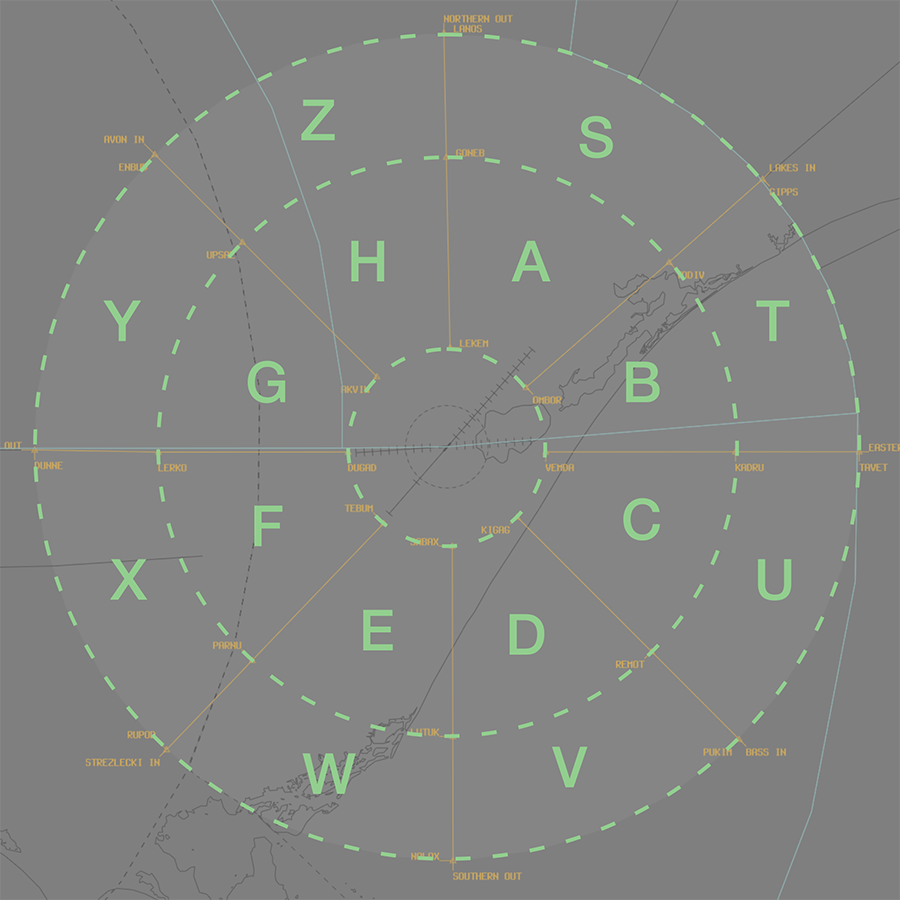
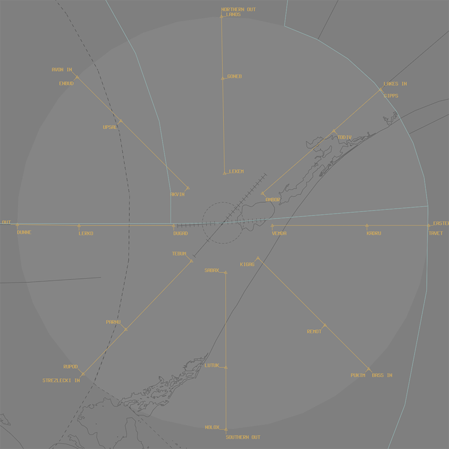

--8<-- "includes/abbreviations.md"

## Airspace
When **ESA** is online, the following restricted areas are activated by default and reclassified as Class C airspace:

- M301A `A040 - F210`
- R360A `SFC - A060`
- R360B `A010 - A060`
- R360C `A060 - F210`
- R360D `A040 - F210`
- R360EF `A060 - F210`

### Tower Closed Procedures
When **ES TCU** is offline, the restricted airspace `F210` and below reverts to Class G. CTAF procedures apply at YMES and [YWSL](./westsale.md).

## Circuits
### Circuit Direction

| Runway | Direction |
| ------ | ----------|
| 09     | Left      |
| 22     | Left      |
| 04     | Right     |
| 27     | Right     |

## Departures
VFR aircraft should expect to depart via a visual departure, on track to their first tracking point.

Civil IFR aircraft shall expect to be cleared via the **Radar SID** or **visual departure**.

Military aircraft planned via **AY VOR**, **ANTLA**, **BULKO**, **DUNNE**, **GIPPS**, **MNG NDB**, **MOZZA**, **NUNPA**, **TYERS**, **VALDU**, or **VISER** shall be assigned the **Procedural SID** that terminates at the appropriate waypoint 

## Arrivals
An RNP approach is available to RWY 09, RWY 22, and RWY 27.

IFR aircraft can generally expect to be processed direct to the IAF for the following approach:

| Runway | Approach |
| --- | --- |
| RWY 09 | RNP |
| RWY 22 | RNP |
| RWY 27 | RNP |

VFR aircraft can expect to join the circuit for the most suitable runway.

Military aircraft from the south may be cleared via a STAR.

### Initial and Pitch
The intial points are aligned with Taxiway A at the following locations.

| RWY  | Initial Point | Altitude |
| ---- | ------------- | -------- |
| 04   | Longford Road overpass | `A015` |
| 09   | Comfort Inn Motel      | `A015` |
| 22   | Lake 2NM west of Lake Wellington Yacht Club | `A015` |
| 27   | Western edge of Lake Wellington | `A015` |

## Special Use Airspace
### Coded Clearances
Aircraft departing to specified training areas may be cleared via a coded clearance.

#### Low Flying Area
The **Low Flying Area** is located in the south-west of the ES TMA `SFC-A020`, entirely within the R360A restricted area.

Aircraft requesting clearance to operate in the area can expect to be cleared a 'LOW FLYING AREA' clearance. This clearance gives aircraft permission to track to, and operate within, the area.

!!! phraseology
    **ALDN11**: "Sale Delivery, ALDN11 for Low Flying Area, request clearance.”   
    **ES ACD**: "ALDN11, cleared LOW FLYING AREA, squawk 0361, departure frequency 123.3"    
    **ALDN11**: "Cleared LOW FLYING AREA, squawk 0361, departure frequency 123.3, ALDN11"
    
#### Roulette Training Area
The **Roulette Training Areas** are located in the north-east of the ES TMA `SFC-A060`, entirely within the R360A restricted area. There are two training areas:

- Training Area North
- Training Area South

Aircraft requesting clearance to operate in the area can expect to be cleared a 'ROULETTE TRAINING AREA' clearance. This clearance gives aircraft permission to track to, and operate within, the area.

!!! phraseology
    **RLTS11**: "Sale Delivery, RLTS11 for Roulette Training Area South, request clearance.”   
    **ES ACD**: "RLTS11, cleared ROULETTE TRAINING AREA SOUTH, squawk 0362, departure frequency 123.3"    
    **RLTS11**: "Cleared ROULETTE TRAINING AREA SOUTH, squawk 0362, departure frequency 123.3, RLTS11"    

### Training Areas
The ES TMA is divided into sixteen individual training areas to facilitate local training operations. 

<figure markdown>
{ width="700" }
  <figcaption>ES Training Areas</figcaption>
</figure>

The inner training areas (designated 'A-H') extend from 12NM to 35NM YMES ARP, and the outer training areas (designated 'S-Z') extend from 35NM to 50NM YMES ARP.

Aircraft requesting clearance to operate in a training area should expect to be cleared via the appropriate [military gate or lane](#military-gates).

### Military Gates
There are numerous [military lanes](../../../controller-skills/military/#military-gates) established throughout the ES TMA to facilitate entry and exit to [training areas](#training-areas) and SUA.

| Intended [Training Area](#training-areas) | Outbound Lane  |
| ----------------------------------------- | -------------- |
| A, H, S, Z | NORTHERN Lane |
| B, C, T, U | EASTERN Lane  |
| D, E, V, W | SOUTHERN Lane |
| F, G, X, Y | WESTERN Lane  |

<figure markdown>
{ width="700" }
  <figcaption>ES SUA Gates</figcaption>
</figure>

Pilots should include the desired departure lane when requesting clearance.

!!! phraseology
    *DNGO31 plans to enter Training Area A via Northern Lane for military training and airwork.*  
    **DNGO31**: "Sale Delivery, DNGO31 for ALPHA via Northern Lane, request clearance.”   
    **ES ACD**: "DNGO31, cleared ALPHA via Northern Lane, climb to `A060`, squawk 0362, departure frequency 123.3" 
    **DNGO31**: "Cleared ALPHA via Northern Lane, climb to `A060`, squawk 0362, departure frequency 123.3, DNGO31" 
	
## Helicopter Operations
### Helipads
There are two helipads at YMES: 

- **Pad A** (at the intersection of Taxiways A and D)
- **SAR Pad** (apron north of the SAR hangar)

Both helipads are outside of the manoeuvring area so no takeoff or landing clearances will be issued. Instead, helicopters will be instructed to report airborne or report on the ground.

!!! phraseology 
    **ES ADC**: "CHOP22, Pad A, report on the ground"  

When Runway 09/27 is being used for fixed-wing circuit training, helicopters will be processed via the the Runway 04 threshold, landing and taking off parallel to Runway 09/27. 