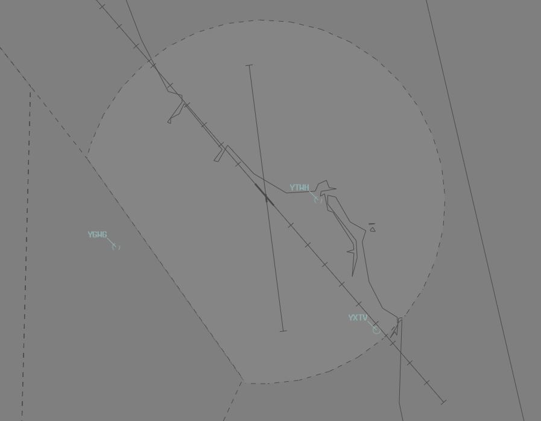

--8<-- "includes/abbreviations.md"

## Airspace
CG ADC is responsible for the Class C Airspace within the CG CTR `SFC` to `A015`.

## Departures
VFR aircraft should expect to depart via a visual departure over water, thence on track to their first tracking point.

IFR aircraft should expect to be issued with a SID as per below:

| Aircraft Type | Runway | First Waypoint | SID |
| --- | --- | --- | --- |
| Jets | All | APAGI | APAGI SID |

All other aircraft shall expect the **CG (RADAR) SID**.

### Start Clearance
A start clearance is required for aircraft planned to YBBN.

### Intersection Departures
Unless a full-length departure is operationally required, aircraft departing **Runway 32** must use the Taxiway **K** intersection for departure.

## Arrivals
An ILS is available to RWY 14. RNP, RNP(AR), and VOR approaches are available to RWY 14 & RWY 32. RWY 17 & RWY 35 do not have any associated instrument approaches.

IFR aircraft can generally expect to be processed via a STAR terminating with the following approach:

| Runway | Approach |
| --- | --- |
| RWY 14 | RNP(AR) or RNP if unable |
| RWY 32 | RNP |

IFR aircraft from the north can generally expect tracking `BN Y177 IDRIL CG2SA/CG2NC`.

Light VFR aircraft may be processed to RWY 17 for a visual approach.

## Circuits    
Circuits are conducted at `A010`.  

| Runway               | Direction       |
| ------------------ | -------------- |
| 14 | Left  |
| 32 | Right  |
| 17 | Left | 
| 35 | Right    |

## VFR Procedures
### Arrivals
#### From the North
Aircraft approaching from the north shall contact CG ADC at Q1 or ROTC for clearance. Aircraft may expect clearance to track coastal southbound, thence instructions to join the circuit.

!!! phraseology
    **OMU:** "Gold Coast Tower, Cessna 172 OMU, abeam Q1, recieved F, inbound, request clearance"  
    **CG ADC:** "OMU, Gold Coast Tower, cleared overwater southbound, not above `A015`"  
    **OMU:** "Cleared overwater southbound, not above `A015`, OMU"

    **CG ADC:** "OMU, track for final runway 14, cleared visual approach"  
    **OMU:** "Track for final runway 14, cleared visual approach, OMU"

Depending on the current traffic situation, pilots may expect a clearance via ROTC and/or to maintain own separation with any arriving or departing aircraft.

!!! phraseology
    **BTA:** "Gold Coast Tower, Sling BTA, abeam Q1, inbound, received P, request clearance"  
    **CG ADC:** "BTA, Gold Coast Tower, remain outside Class C airspace, expect a clearance tracking via ROTC, report approaching ROTC."  
    **BTA:** "Remain outside Class C airspace, wilco, BTA"  

    **CG ADC:** "BTA, traffic is an A320, 1 mile north of BLGH, report sighting and able to maintain own separation"  
    **BTA:** "Traffic in sight, we're able to maintain own separation, BTA"  
    **CG ADC:** "BTA, follow the A320, maintain own separation, track for final runway 14, cleared visual approach"  
    **BTA:** "Follow the A320, maintain own separation, track for final runway 14, cleared visual approach BTA"  

#### From the South
Aircraft approaching from the south shall contact CG ADC approaching HASS for clearance. Aircraft may expect to be instructed to join the circuit for the duty runway.

!!! phraseology
    **FTQ:** "Gold Coast Tower, Cherokee FTQ, HASS, `A015`, inbound, received H, request clearance"  
    **CG ADC:** "FTQ, Gold Coast Tower, join final runway 32, cleared visual approach"  
    **FTQ:** "Join final runway 32, cleared visual approach, FTQ"

Depending on the current traffic situation and duty runway, pilots may be instructed to remain OCTA and report again at CGD (for runway 32), or to track northbound overwater with a clearance limit of CIS (for runway 14).

!!! phraseology
    **JCZ:** "Gold Coast Tower, Cessna 172 JCZ, HASS, `A015`, inbound, received M, request clearance"  
    **CG ADC:** "JCZ, Gold Coast Tower, cleared overwater northbound, not above `A015`, clearance limit CIS"  
    **JCZ:** "Cleared overwater northbound, not above `A015`, clearance limit CIS, JCZ"

    **CG ADC:** "JCZ, cancel clearance limit, track coastal northbound, report DNGR"  
    **JCZ:** "Cancel clearance limit, track coastal northbound, JCZ"  

    **JCZ:** "JCZ, DNGR"  
    **CG ADC:** "JCZ, join left base runway 14, cleared visual approach"   
    **JCZ:** "Join left base runway 14, cleared visual approach, JCZ" 

!!! phraseology
    **LKU:** "Gold Coast Tower, Cherokee LKU, HASS, `A015`, inbound, received B, request clearance"  
    **CG ADC:** "LKU, Gold Coast Tower, remain outside Class C airspace, report again at CGD"  
    **LKU:** "Remain outside Class C airspace, LKU"  

    **LKU:** "LKU, CDG"  
    **CG ADC:** "LKU, expect clearance in three minutes due inbound traffic, report sighting and able to maintain own separation with a 737, currently on a 12nm final runway 32"  
    **LKU:** "Wilco, LKU"  

    **LKU:** "LKU, traffic sighted, we can maintain own separation"  
    **CG ADC:** "LKU, follow the 737, maintain own separation, join final runway 32, cleared visual approach"  
    **LKU:** "Follow the 737, maintain own separation, join final runway 32, cleared visual approach, LKU"

### Low-Level Coastal Flights
Surf Lifesaving Patrol and Scenic Tour operations conducting low-level coastal flights within the CG CTR may expect a clearance overwater in the required direction of travel, not above `A002`.

!!! phraseology
    **LIFE46:** "Gold Coast Tower, helicopter LIFE46, Q1, 3 POB, for low level coastal operations, received G, request clearance"  
    **CG ADC:** "LIFE46, Gold Coast Tower, cleared overwater southbound, not above `A002`"  
    **LIFE46:** "Cleared overwater southbound, not above `A002`, LIFE46"

### Western VFR Route
The Western VFR Route begins at NEN and tracks inland, terminating at Burringbar. It should generally be flown at `A015` (higher levels will require clearance). This route serves as an alternative route for aircraft wishing to transit through Gold Coast CTR.

!!! phraseology
    **WCS:** "Gold Coast Tower, helicopter WCS, NEN, `A015`, for Western VFR Route, received F, request clearance"  
    **CG ADC:** "WCS, Gold Coast Tower, cleared Western VFR Route, not above `A015`, QNH 1013"  
    **WCS:** "Cleared Western VFR Route, not above `A015`, QNH 1013, WCS"  

    Pilots shall report once clear of CTA.

    **WCS:** "WCS, clear of Class C airspace"  
    **CG ADC:** "WCS, control services terminated, frequency change approved"   
    **WCS:** "Frequency change approved, WCS" 

    Aircraft should then transfer to area frequency/advisory frequency.

!!! tip
    You can find details of the Western VFR Route on the [Gold Coast VTC](https://www.airservicesaustralia.com/aip/aip.asp){target=new}.

## Helicopter Operations
Local helicopter operations are conducted on the Western Grass which is the area contained by blue gable markers north of the VOR and west of the runway intersection. This is marked on the aerodrome chart as 'HELO OPS'. The HLS is located between the GA Apron and Taxiway Golf. Circuits from the Western Grass are to be made in the same direction as the duty runway.

### Hospital Helipads
Within the Gold Coast CTR, there are two main hospital helipads. Tweed Heads Hospital (YTWH), and Tweed Valley Hospital (YXTV).

<figure markdown>
{ width="600" }
    <figcaption>CG Hospital Helipads</figcaption>
</figure>

#### Arrivals
Helicopters inbound shall contact CG ADC. Depending on the current traffic situation, pilots may expect an instruction to hold and/or maintain own separation with any arriving or departing aircraft. Helicopters can then expect a visual approach to their inbound hospital.

!!! phraseology
    **WP1:** "Gold Coast Tower, helicopter WP1, 6 miles south, inbound YXTV, received G"  
    **CG ADC:** "WP1, Gold Coast Tower, cleared to YXTV direct, not above `A015`"  
    **WP1:** "Cleared to YXTV direct, not above `A015`, WP1"  

Both hospital helipads are outside the maneuvering area and do not require a landing clearance from CG ADC. Helicopters arriving to these helipads will be instructed to "report on the ground" so the controller knows when aircraft are no longer active in their airspace.

!!! phraseology
    **CG ADC:** "WP1, cleared visual approach YXTV, report on the ground"  
    **WP1:** "Cleared visual approach YXTV, wilco, WP1"  

#### Departures
Aircraft departing from hospitals within the Gold Coast CTR must obtain clearance prior to becoming airborne. Aircraft will be subject to delays depending on traffic in the Gold Coast CTR.

Both hospital helipads are outside the maneuvering area and do not require a takeoff clearance from CG ADC, however a clearance to become airborne is required. Helicopters departing from these helipads will be instructed to "report airborne".

!!! phraseology
    **RSCU588:** "Gold Coast Tower, helicopter RSCU588, YXTV, ready for northen departure"  
    **CG ADC:** "RSCU588, Gold Coast Tower, remain on the ground, expect clearance in 3 minutes due traffic"  
    **RSCU588:** "Remain on the ground, RSCU588"

    **CG ADC:** "RSCU588, Cleared to YBBN via STOT, flight planned route. Not above `A015`, report airborne"  
    **RSCU588:** "Cleared to YBBN via STOT, flight planned route. Not above `A015`, wilco, RSCU588"  

Helicopters conducting scenic flights around the city require access to the Brisbane CTA to operate. These flights typically involve low-level operations inside controlled airspace and in proximity to landmarks within the city area.

Aircraft must track via Class G airspace to UQLD and contact BN TCU prior to reaching UQLD requesting airways clearance. If a clearance cannot be given immediately, aircraft may be instructed to remain clear of Class C airspace.

!!! phraseology 
    **FHK**: "Departures, helicopter FHK, 2 miles south UQLD `A010`, for city scenic, request airways clearance"  
    **BN TCU**: "FHK, Departures, squawk 1562, remain outside Class C airspace"  
    **FHK**: "Squawk 1562, remain OCTA, FHK"  

    **BN TCU**: "FHK, identified, cleared to enter controlled airspace remaining west of SBD, not above `A010`, Brisbane QNH 1026"  
    **FHK**: "Cleared to enter controlled airspace remaining west of SBD, not above `A010`, QNH 1026, FHK"

Due to the close proximity to YBBN, aircraft may be instructed to maintain visual separation with arriving or departing aircraft.

!!! phraseology 
    **BN TCU**: "FHK, report sighting an Embraer E190 departing runway 19R, through `A008` on climb."  
    **FHK**: Traffic in sight, FHK"  
    **BN TCU**: "FHK, maintain own seperation with the E190"  
    **FHK**: "Maintain own seperation, FHK"  

    **BN TCU**: "QFA1864, traffic is a helicopter operating over the CBD not above `A010`, maintaining own separation with you"  
    **QFA1864:** "QFA1864"

Pilots shall report once clear of CTA.

!!! phraseology 
    **FHK**: "FHK, excited the zone"  
    **BN TCU**: "FHK, identification and control service terminated, frequency change approved"  
    **FHK**: "Frequency change approved, FHK"

Aircraft should then transfer to area frequency/advisory frequency.