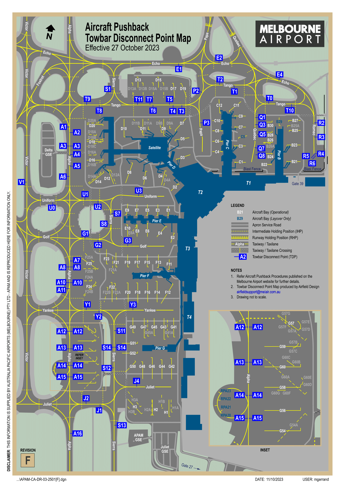

--8<-- "includes/abbreviations.md"

## Taxiing
### Standard Taxi Routes
Standard taxi routes exist to simplify issued taxi instructions. Unless explicit instructions are received, the following taxiways should be used in the directions indicated below:

| Taxiway | Direction of Travel |
| ------- | ------------------- |
| Alpha | Opposite to Duty Runway |
| Victor | Same Direction as Duty Runway |

<figure markdown>
{ width="600" }
    <figcaption>Melbourne Standard Taxi Routes</figcaption>
</figure>

!!! example
    With runway 34 in use, taxiway Alpha would be used for aircraft taxiing southbound and taxiway Victor would be used for aircraft taxiing northbound.

!!! warning "Important"
    SMC may issue instructions that differ from these standard taxi routes. Always comply with SMC's instructions.

## Departures
VFR aircraft should expect to depart via a visual departure, on track to their first tracking point.

IFR aircraft should expect to be issued with a SID as per below:

| Aircraft Type | Runway | First Waypoint | SID |
| --- | --- | --- | --- |
| Jets | All | CORRS | CORRS SID |
| Jets | All | CRENA | CRENA SID |
| Jets | All | DOSEL | DOSEL SID |
| Jets | All | ESDIG | ESDIG SID |
| Jets | All | KEPPA | KEPPA SID |
| Jets | All | MNG | MNG SID |
| Jets | All | NONIX | NONIX SID |
| Jets | All | PEDNI | PEDNI SID |
| Jets | All | SUNTI | SUNTI SID |

All other aircraft shall expect the **ML (RADAR) SID**.

!!! note
    With RWY 27 nominated as the duty departure runway, aircraft requiring the use of RWY 16 for the west or north should expect to be issued with the ISPEG SID.

### Pushback/Taxi on ACD
During periods of high traffic, pilots may be required contact ACD for pushback. ACD will assess aerodrome congestion and sequence departing aircraft before transferring them to SMC. Delays should be expected.

When the ATIS includes `ALL DEPARTURES MUST REQUEST PUSH BACK ON 127.2`, all pilots must contact ACD when ready for pushback or taxi (if no pushback is required).

!!! phraseology
    **JST14:** "JST14, bay 32, request pushback"  
    **ML ACD:** "JST14, standby, estimated delay 10 minutes"  

When instructed, pilots must switch to SMC and **monitor** the frequency. **Do not contact SMC**, they will call you.

!!! phraseology
    **ML ACD**: "JST14, standby for ground, 121.7"  
    **JST14**: "Standby for ground, 121.7, JST14"  

    *Pilot switches to 121.7 and <strong>waits for the controller to contact them</strong>.*

    **ML SMC**: "JST14, Melbourne Ground, pushback approved"  
    **JST14**: "Pushback approved, JST14"

There may be a delay on the SMC frequency before the controller contacts you. Pilots should only initiate contact with SMC if a significant amount of time has passed since the frequency transfer and no contact has been made by the controller. During busy periods with high frequency congestion, delays may be lengthy.

### Pushback Disconnect Points
Towbar disconnect points (TDPs) are positions on the aprons and taxiways where a tug may disconnect from an aircraft, completing the pushback. Every bay has a standard TDP, however a different TDP is occassionally assigned by SMC to expedite ground traffic flow.

!!! warning "Important"
    Third-party simulator plugins may be necessary to customise your pushback and utilise a published disconnect point. For that reason, they are **not** used by default. However, ATC may ask whether you are capable of towing to a disconnect point and provide the instruction where it would benefit the flow of traffic.

<figure markdown>
{ width="500" }
    <figcaption>Melbourne Disconnect Points Map</figcaption>
</figure>

!!! phraseology
    **QFA728**: "Melbourne Ground, QFA728, received November, bay Charlie 11, request pushback"  
    **ML SMC**: "QFA728, pushback approved, disconnect point Tango 10"  
    **QFA728**: "Pushback approved, disconnect point Tango 10, QFA728"

## Arrivals
An ILS is available for RWY 16 and RWY 27. RNP and GLS approaches are available for all runways. RNP(AR) approaches are available for RWY 16. VOR approaches are available for RWY 09, RWY 27 and RWY 34.

IFR aircraft can generally expect to be processed via a STAR terminating with the following approach:

| Runway | Approach |
| --- | --- |
| 09 | RNP |
| 16 | ILS |
| 27 | ILS |
| 34 | RNP |

With RWY 34 in use, aircraft from the northeast may be cleared via the Victor STAR for a visual approach. Refer to the relevant chart and be aware of the tight turn from base to final. Careful planning and speed control is necessary to avoid overshooting final.

### Preferred Runway Exits
The `AIRPORT EFFICIENCY PROCEDURES` chart dictates preferred runway exits for pilots to vacate at. This ensures a predictable, efficient movement of aircraft on the aerodrome and should be abided by where possible. Where a preferred exit is not assured, pilots must inform ADC.

| Runway | Aircraft Type | Preferred Exits |
| --- | --- | --- |
| RWY 09 | Turboprop Other | A P, otherwise Q |
| RWY 16 | All | G, otherwise E or J |
| RWY 27 | All Heavy | N M |
| RWY 34 | All | F, otherwise E or C |

### Rerouting
Some aircraft from the northeast may be rerouted direct to the IAF for the RNP-M approach to RWY 16 for traffic management. Aircraft inbound from the south may be processed via the PORTS STAR in lieu of the RAZZI STAR.

### Predictable Sequencing Waypoints
ATC may utilise [predictable sequencing waypoints](../../airspace/cta.md#predictable-sequencing-waypoints) to tactically delay aircraft inbound via **Q29**, **Q346**, **Q35**, **H215**, **P753**, **L508**, and **M625**. Pilots should be aware of the following waypoints and expect possible tracking as per the table below.

=== "Q29"
    | Initial Waypoint | New Waypoint | Final Waypoint | Delay (in mins) |
    | ---------------- | ------------ | -------------- | --------------- |
    | ANLID | DOVEX | BULLA | 2 |
    | ANLID | TOPUL | BULLA | 4 |
    | ANLID | UNSIG | BULLA | 6 |
    | ANLID | NILEV | BULLA | 8 | 

=== "Q346"
    | Initial Waypoint | New Waypoint | Final Waypoint | Delay (in mins) |
    | ---------------- | ------------ | -------------- | --------------- |
    | UPNAP | IGPEB | DORSU | 1 |
    | UPNAP | ONOPO | DORSU | 3 |
    | UPNAP | URGUL | DORSU | 5 |
    | UPNAP | IBOVU | DORSU | 7 | 

=== "Q35"
    | Initial Waypoint | New Waypoint | Final Waypoint | Delay (in mins) |
    | ---------------- | ------------ | -------------- | --------------- |
    | IGMIL | IGPEB | DORSU | 2 |
    | IGMIL | ONOPO | DORSU | 4 |
    | IGMIL | URGUL | DORSU | 6 |
    | IGMIL | IBOVU | DORSU | 8 |

=== "M625"
    | Initial Waypoint | New Waypoint | Final Waypoint | Delay (in mins) |
    | ---------------- | ------------ | -------------- | --------------- |
    | ELNIV | OTGUN | RAZZI | 2 |
    | ELNIV | OSEMI | RAZZI | 4 |
    | ELNIV | UGITO | RAZZI | 6 |
    | ELNIV | SEBLU | RAZZI | 8 | 

=== "H215"
    | Initial Waypoint | New Waypoint | Final Waypoint | Delay (in mins) |
    | ---------------- | ------------ | -------------- | --------------- |
    | AKTAM | SEBLU | RAZZI | 2 |
    | AKTAM | UGITO | RAZZI | 4 |
    | AKTAM | OSEMI | RAZZI | 6 |
    | AKTAM | OTGUN | RAZZI | 8 |

## LAHSO
LAHSO is the independent operation of two crossing runways for arrivals and departures. It is a complicated procedure which is rarely used, but occassionally run during VATPAC's busiest events featuring YMML. Strict pilot requirements apply during LAHSO.

The **active** aircraft is the landing aircraft issued with a hold short instruction, prohibiting them from rolling out on their assigned runway beyond the intersection with the crossing runway.

The **passive** aircraft is the landing or departing aircraft which has full use of their assigned runway.

YMML operates LAHSO using **RWY 27** as the passive runway and **RWY 34** as the active runway.

### Pilot Requirements
All Australian registered aircraft operating under a flight number callsign are assumed to be **approved active participants**. If a pilot is unable to participate, ATC must be informed no later than 120nm from the destination aerodrome.

!!! phraseology
    **VOZ852**: "VOZ852, negative active LAHSO"  
    **BLA**: "VOZ852"

Other pilots who wish to participate must notify ATC no later than 200nm from the destination aerodrome.

!!! phraseology
    **ANZ1984**: "Melbourne Centre, ANZ1984, maintaining F360, LAHSO approved"  
    **BLA**: "ANZ1984, Melbourne Centre"

Pilots who are unable to participate actively will be sequenced as a passive aircraft. Pilots who are unable to participate at all will be sequenced for an independent approach.

## Scenic Flights
### Melbourne Coastal Route
A designated VFR route is established on the shores of Port Phillip Bay. This route is flown below the base of controlled airspace and an airways clearance is not required. Details of the route can be found on the Melbourne VTC. Pilots should make appropriate broadcasts on the advisory frequency, so as to remain clear of other aircraft operating on the route.

!!! tip
    The Melbourne VTC can be found on the [AIP Website](https://www.airservicesaustralia.com/aip/aip.asp).

Recommended altitudes have been established to segregate opposite direction traffic, as per below:

<table>
    <thead>
        <tr>
            <th>Route Segment</th>
            <th>Direction of Travel</th>
            <th>Recommended Altitude</th>
        </tr>
    </thead>
    <tbody>
        <tr>
            <td rowspan="2">Laverton BOM Tower to Point Ormond</td>
            <td>Eastbound</td>
            <td>A015</td>
        </tr>
        <tr>
            <td>Westbound</td>
            <td>A020</td>
        </tr>
        <tr>
            <td rowspan="2">Port Ormond to Carrum</td>
            <td>Southbound</td>
            <td>A015</td>
        </tr>
        <tr>
            <td>Northbound</td>
            <td>A025</td>
        </tr>
    </tbody>
</table>

Keep to the right side of the lane to avoid oncoming traffic and ensure you avoid the Moorabbin CTR.

### Melbourne City Orbits
Visual orbits of the CBD are managed by **Essendon ADC**, or **Melbourne TCU** when the Tower is closed.

See [Melbourne City Orbits](./essendon.md#melbourne-city-orbits).