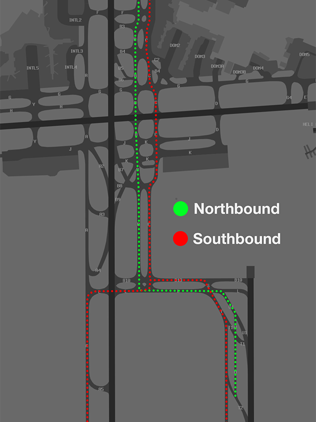
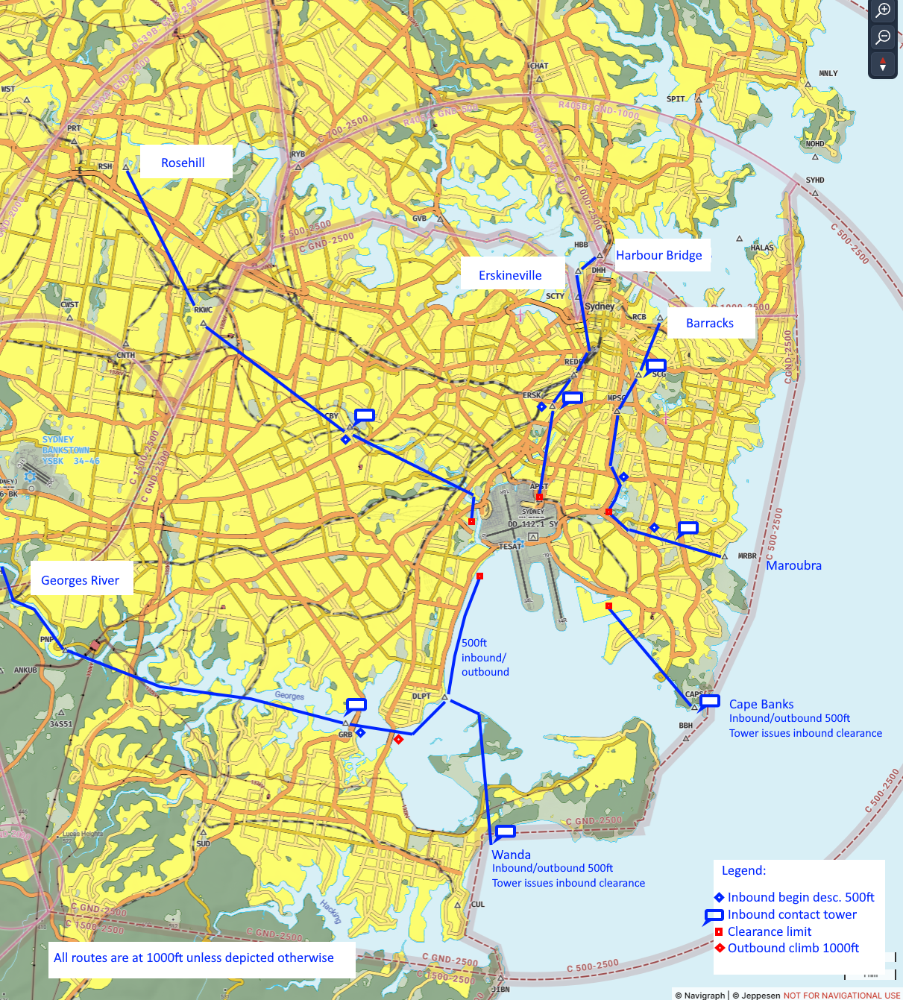

--8<-- "includes/abbreviations.md"

## Taxiing
Two SMC positions exist which may sometimes be activated online. Everything west of RWY 16R is administered by SMC West, everything east of the runway is administered by SMC East.

### Standard Taxi Routes
Standard Taxi Routes are utilised at Sydney to simplify taxi instructions and provide a streamlined movement of aircraft. Except where other explicit taxi instructions are given, pilots shall follow the routes described below.

!!! warning "Important"
    SMC may provide instructions which contradict these standard taxi routes. Ensure you comply with any issued taxi instruction at all times.

    Regardless of the taxi route used, all runway crossings require a specific clearance.

| Taxiway | Direction of Travel |
| ------- | ------------------- |
| **B** | Northbound |
| **C** | Southbound |
| **B10** | Eastbound (except holding point for 34L) |
| **L** | Westbound |

<figure markdown>
{ width="400" }
    <figcaption>Sydney Standard Taxi Routes</figcaption>
</figure>

[Arrivals on RWY 16L/34R](#runway-16l34r-procedures) shall follow standard taxi routes when vacating the runway.

| Landing Runway | Route |
| --- | --- |
| **RWY 16L** | T, L |
| **RWY 34R** | T2, U, U1, L, or U1, L |

Additional standard taxi routes exist into and out of some domestic aprons.

=== "Arrivals"

    | Parking Position | Route |
    | --- | --- |
    | **B1 Apron** | B |
    | **DOM1 & DOM1A** | B, B2 |
    | **Taxiway C (Bays 11-14)** | B, C1 |
    | **Taxiway C (Bays 16-19)** | B, F |
    | **Taxiway C (Bays 49, 53, 55)** | B, B3 |
    | **Taxiway C (Bays 57, 59)** | B, B4 |
    | **DOM2 (All bays except below)** | B, B4, C2 |
    | **DOM2 (Bays 43, 45A)** | B, B4 |
    | **DOM2 - A330 aircraft (Bays 39, 45)** | B, G, DOM2 |
    | **DOM3, DOM3A, DOM3B, DOM4, DOM5 & DOM6** | B, G |
    
=== "Departures"

    | Parking Position | Departure Runway | Route |
    | --- | --- | --- |
    | **B1 Apron** | 16R 16L 34L - Prop 34L - Jet 34R | B1 B1, C, B10 B1, C, B10 B1, C, L, A, A6 B1, C, B10, S, T, T6 |
    | **DOM1, DOM1A & Taxiway C Bays** | 16R 16L 34L - Prop 34L - Jet 34R | As Directed by ATC C, B10 C, B10 C, L, A, A6 C, B10, S, T, T6 |
    | **DOM2 (All bays except below)** | 16R 16L 34L - Prop 34L - Jet 34R | C2, B4 DOM2, C, B10 DOM2, C, B10 DOM2, C, L, A, A6 DOM2, C, B10, S, T, T6 |
    | **DOM2 (Bays 43, 45A)** | 16R 16L 34L - Prop 34L - Jet 34R | B4 DOM2, C, B10 DOM2, C, B10 DOm2, C, L, A, A6 DOM2, C, B10, S, T, T6 |
    | **DOM2 - A330 aircraft (Bays 39, 45)** | 16R 16L 34L 34R | DOM2, G, B DOM2, C, B10 DOM2, C, L, A, A6 DOM2, C, B10, S, T, T6 |
    | **DOM3, DOM3A, DOM3B, DOM4, DOM5 & DOM6** | 16R 16L 34L - Prop 34L - Jet 34R | G G, C, B10 G, C, B10 G, C, L, A, A6 G, C, B10, S, T, T6 |

### Runway 16L/34R Procedures
RWY 16L/34R is controlled by a separate ADC position (SY-E_TWR) which covers the duties of both SMC and ADC east of taxiway C and south of B10.

In line with Australian radio-telephony procedures, only international aircraft will receive an explicit transfer from SMC to ADC, and vice versa. When taxiing to RWY 16L/34R, domestic aircraft shall contact ADC when turning onto taxiway B10.

[Standard taxi routes](#standard-taxi-routes) exist for aircraft to utilise after landing on RWY 16L/34R, which should be performed without prompting by ADC.

Inbound aircraft must remain on the tower frequency until west of Taxiway S, then contact SMC on 121.7. International aircraft will be issued with an explicit frequency transfer.

!!! warning "Important"  
    When taxiing westbound on TWY L, all aircraft must hold short of TWY C until in receipt of onwards taxi instructions from SMC.

## Departures
### Departure Runway
During PROPS, pilots can expect to be assigned a departure runway in accordance with the table below.

| Aircraft tracking | Runway  |
| ----------------| --------- |
| via KADOM   | 16R/34L      |
| Jets via WOL | 16R/**34R** |
| Non-Jets via WOL | 16R/34L |
| via RIC | 16R/34L |
| via OLSEM | 16L/34R |
| Other aircraft: |
| To the NORTH and EAST | 16L/34R |
| To the SOUTH and WEST | 16R/34L |

Jet departures to the south may be assigned RWY 16L/34L ad-hoc for traffic management purposes. ATC may nominate RWY 16L for all jet departures via WOL instead on an ad-hoc basis. This will be informed via ATIS as "DOMESTIC JET DEPARTURES VIA WOL EXPECT RWY 16L".

!!! note 
    Aircraft which operationally require a different to that listed above must notify ATC at Clearance Delivery stage.

### Departure Procedures
VFR aircraft should expect a visual departure, on track to their first waypoint.

IFR aircraft should expect to be issued with a SID as per below:

| Aircraft Type | Runway | First Waypoint | SID |
| --- | --- | --- | --- |
| Jets | 07 | OLSEM, WOL | FISHA SID, *Appropriate Transition* |
| Jets | 07 | *All Others* | FISHA SID, Radar Transition |
| Jets | 16L | WOL | KEVIN SID, or ABBEY SID (during SODROPS only) |
| Jets | 16L | CAWLY, EVONN, DIPSO, NOBAR, OLSEM, OPTIC | KEVIN SID, *Appropriate Transition* |
| Jets | 16L | *All Others* | KEVIN SID, Radar Transition |
| Jets | 16R | KADOM, RIC, WOL | GROOK SID, *Appropriate Transition* |
| Jets | 16R | *All Others* | GROOK SID, Radar Transition |
| Jets | 34L | KADOM | KADOM SID |
| Jets | 34L | RIC | RIC SID, RIC Transition |
| Jets | 34L | WOL | WOL SID |
| Jets | 34L | *All Others* | RIC SID, Radar Transition |
| Jets | 34R | WOL | MARUB SID, WOL Transition |
| Jets | 34R | OLSEM | OLSEM SID |
| Jets | 34R | *All Others* | MARUB SID, Radar Transition |

All other aircraft shall expect the **SY (RADAR) SID**.

!!! note  
    ATC may issue IFR jet departures the SY (RADAR) SID for traffic management or weather purposes.

### Runway 34L Intersection Departures
Due to noise-abatement rules, intersection departures are only available for **Non-Jet** aircraft. However, at pilot request, ATS *may* waive this requirement due to the lack of noise sensitive residents in the virtual world.

### Pushback Towbar Disconnect Points
Towbar disconnect points may be used occassionally to expedite traffic flow and provide separation assurance between aircraft operating on the apron.

!!! warning "Important"
    Third-party simulator plugins may be necessary to customise your pushback and utilise a published disconnect point. For that reason, they are **not** used by default. However, ATC may ask whether you are capable of towing to a disconnect point and provide the instruction where it would benefit the flow of traffic.

## Arrivals
ILS, GLS, and RNP approaches are available to all runways. During VMC, [Independent Visual Approaches](#independent-visual-approaches-ivas) are utilised to each set of parallel runways.

IFR aircraft shall be processed via a STAR terminating with vectors to final, excluding the MARLN STAR to RWY 25 and BOREE PAPA STAR to RWY 16R, which terminate at their appropriate IAF.

ATS will process arrivals via a visual approach (or IVA) during VMC or an ILS approach otherwise. Pilots wishing to conduct a GLS must request that approach on first contact.

The BOREE PAPA STAR is only used during ILS PRM operations.

### Preferred Runway Exits
The `AIRPORT EFFICIENCY PROCEDURES` chart dictates preferred runway exits for aircraft to vacate at. To ensure minimum runway occupancy time and support optimum spacing on final, whenever operational conditions permit, pilots should plan to vacate via the exit taxiways specified in the table below:

| RWY | Aircraft Type | Preferred TWY Exits |
| --- | ------------- | ------------------- |
| 07 | Non-Jet Jet except A388, B748, A346, B773 A388, B748, A346, B773 | B D G4 |
| 25 | Non-Jet Jet | B Y |
| 16L | Non-Jet Jet | T3 T3, T4 |
| 16R | Domestic Terminal - All Types International Terminal - All Types | B7 A4 |
| 34L | Domestic Terminal - All Types International Terminal - All Types | B9 A2 |
| 34R | Non-Jet Jet | T2 U1

!!! note  
    Non-Jet aircraft preferring to vacate north of TWY B7 must advise ADC prior to receiving a landing clearance.

### Rerouting
Some aircraft from the north or west may be rerouted via the adjacent STAR for traffic management. Pilots should be aware of the following waypoints and expect possible tracking as per the table below.

| Inbound Direction | Amended STAR | Possible Routing |
| --- | --- | --- |
| North | BOREE STAR | DCT BOREE, *or* DCT SADLO BOREE |
| North | MEPIL STAR | DCT YAKKA MEPIL |
| West | ODALE STAR | DCT MAKKA AKMIR ODALE, *or* DCT AKMIR WELSH ODALE |
| West | RIVET STAR | DCT RIVET, *or* DCT TARAL RIVET |

### Predictable Sequencing Waypoints
ATS may utilise [predictable sequencing waypoints](../../airspace/cta.md#predictable-sequencing-waypoints) to tactically delay aircraft inbound via **N774** and **M636**. Pilots should be aware of the following waypoints and expect possible tracking as per the table below.

=== "N774"
    | Initial Waypoint | New Waypoint | Final Waypoint | Delay (in mins) |
    | ---------------- | ------------ | -------------- | --------------- |
    | NONID | HARIZ/PORUV | RIKNI | 2 |
    | NONID | AVKIR/ISNET | RIKNI | 4 |
    | NONID | IDAGO/OVMAT | RIKNI | 6 |
    | NONID | ADLIV/FLEMO | RIKNI | 8 |
    | NONID | UDISI/OPEXA | RIKNI | 10 |

=== "M636"
    | Initial Waypoint | New Waypoint | Final Waypoint | Delay (in mins) |
    | ---------------- | ------------ | -------------- | --------------- |
    | PLUGA | OLNOT | RIKNI | 2 |
    | PLUGA | ADBOK | RIKNI | 4 | 
    | PLUGA | PEBTU | RIKNI | 6 |
    | PLUGA | GORTA | RIKNI | 8 | 

### STAR Route Discontinuities
Most STARs terminate with radar vectors from ATS and will generally produce a route discontinuity in the flight management system. **Do not delete the route discontinuity**, as doing so may cause the aircraft to bypass TESAT or track in appropriately.

!!! warning "Important"  
    Some aircraft FMCs may insert a discontinuity after BOOGI, NASHO, or JAKLN. In most cases, these waypoints are followed by a point titled *(VECTORS)*. If your FMC generates a discontinuity instead of a VECTORS waypoint, do not delete the discontinuity. They will function the same.

### Sydney Director
Sydney Director (SY-D_APP & SY-DE_APP) are unique positions responsible for providing vectors to final for inbound aircraft.

On first contact with Director (or as soon as you become visual otherwise), you must report your assigned runway in sight. Aircraft already established on the localiser/final approach course may instead report when visual.

!!! tip
    If Director is not online, Approach will carry out the functions of the position. Report your assigned runway in sight as soon as possible.

Director will generally issue pilots with an estimate of their track miles remaining to aid in descent planning. This distance is from the current aircraft position to the assigned runway threshold. In most cases, this number will range from around 20 to 35 nautical miles. 

!!! phraseology  
    **VOZ853**: "Director, Velocity 853, descending `A060`, Runway 34L in sight."  
    **SY-D_APP**: "Velocity 853, Director, descend to `A030`, 25 miles to run."  
    **VOZ853**: "Descend to `A030`, VOZ853"

The airspace that director owns is very small and often heavily congested. It is imperative that pilots fly their assigned instruction without delay. Pilots will be issued vectors to final, speed restrictions, and altitude instructions that must be flown accurately and as soon as you receive them.

In the event of radio congestion on the base leg, **do not pass through your assigned runway centreline**. Commence the turn to enable intercept of the final approach course for the runway assigned, then track the extended centreline of that runway. If pilots do not receive a handoff to tower by 4nm from the threshold, you may switch to the ADC frequency.

### Independent Visual Approaches (IVAs)
Independent Visual Approaches allow two aircraft on adjacent finals to conduct [visual approaches](../../navigation/vsa.md) without any secondary separation standard in place, greatly increasing the capacity of the parallel runways during PROPS. Depending on the meteorological conditions, IVAs can be initiated from a circuit or from an instrument approach once the pilot is visual.

#### Requirements
To fly the IVA, pilots must report their assigned runway in sight to ATC. If established on the LOC/FAC, pilots may report visual instead.

!!! note  
    Reporting the runway in sight means that you are able to maintain visual reference to the runway along your intended flight path. If there is weather on your anticipated track that will obscure your visibility of the runway, do not report the runway in sight until you are certain you can maintain adequate visual reference.

Pilots should use the ILS or GLS for lateral and vertical guidance when conducting an IVA.

Ensure you do not overshoot your assigned runway centreline. Fly accurate headings when being vectored to final. The vector to final will not be greater than 30 degrees from the runway centreline.

Pilots must manage their speed on the base leg to ensure they do not overshoot the centreline. ATC approach speeds apply, and can be found on the relevant instrument approach chart.

Other aircraft will be operating on the adjacent approach, and ATC will provide surveillance or vertical separation until cleared for an IVA. Traffic information will be provided if another aircraft is within 1NM on final. Pilots must respond to any TCAS alert accordingly.

#### IVAs at Night
When being cleared for an IVA at night, ATC will issue an additional instruction in your approach clearance. This instruction provides a minimum altitude to descend to until established on either the ILS/GLS glidepath or the PAPI.

!!! phraseology  
    **SY-D_APP**: "Ambulance 282, turn right heading 330, join final runway 34R, from that heading cleared Independent Visual Approach, not below 1500 until established on the PAPI."  

#### Missed Approach
In the event of a missed approach, you must fly the published missed approach in accordance with the published instrument approach chart for your assigned runway, unless otherwise directed by ATC.

## Helicopter Operations
Helicopter routes exist using coded clearances for routes regularly flown by helicopters operating in Sydney terminal airspace.

<figure markdown>
{ width="700" }
    <figcaption>Sydney Helicopter Routes</figcaption>
</figure>

The routes are identified by geographical designators and a direction which must be used in all radio communication. Pilots cleared via a coded clearance must comply with all altitudes, clearance limits, and frequency transfer points specified in the route. ATC may amend the altitudes as required.

Details of each coded clearance are available in the `YSSY ERSA FAC`. Pilots **must** study this document to review the lateral and vertical requirements of each coded clearance.

### YSSY Heliport
The heliport at YSSY (excluding H1) is **outside the manoeuvring area**. No takeoff or landing clearances will be issued, instead pilots will be instructed to *"report airborne/on the ground"*. Pilots operating to/from H1 require an explicit takeoff or landing clearance.

When RWY 07 or 25 is in use, the heliport is managed by **ADC West - 120.5**. During all other runway modes, **ADC East - 124.7** (if online) manages the heliport.

### Inbound Procedures
Arriving helicopters shall contact ATC approximately 5 minutes before the prescribed entry gate and advise intentions.

#### TCU Routes
For the following designated routes, pilots must contact **SRI**, or the most appropriate terminal controller if SRI is not online.

| Route | Direction |
|---------|---------------------|
| BONDI 5 | SOUTH or NORTHBOUND |
| ROSEHILL 5 | INBOUND |
| ERSKINVILLE 5 | INBOUND |
| HARBOUR BRIDGE 5 | INBOUND |
| BARRACKS 5 | INBOUND |
| MAROUBRA 5 | INBOUND |

!!! phraseology  
    **XWY**: "Sydney Departures, helicopter XWY, Long Reef, 1000ft, received Delta, request Harbour Bridge 5 Inbound"  
    **SY TCU**: "XWY, squawk 0552, remain outside controlled airspace"  
    **XWY**: "Squawk 0552, remain outside controlled airspace, XWY"  

    **SY TCU**: "XWY, identified, cleared Harbour Bridge 5 Inbound"  
    **XWY**: "Cleared Harbour Bridge 5 Inbound, XWY"  

!!! note
    Where a frequency transfer point is specified, pilots must perform the nominated transfer without prompting from ATS, unless advised otherwise.

#### ADC Routes
For the following routes, pilots must contact **SY ADC** directly.

| Route | Direction | Frequency |
| --- | --- | --- |
| CAPE BANKS 5 | INBOUND | ADC East - 124.7 *(if online)*, Otherwise ADC West - 120.5 |
| WANDA 5 | INBOUND | ADC West - 120.5 |

For helicopters tracking via CAPS or MRBR, pilots should anticipate processing via a different inbound route due to YSSY runway configuration and traffic or sequencing requirements.

### Outbound Procedures
Helicopters departing YSSY shall contact **SY ACD** for airways clearance for all designated routes.

!!! warning "Important"
    Receipt of a clearance **does not** constitute a takeoff clearance.

!!! phraseology
    **YOE:** "Sydney Delivery, helicopter YOE, for the Harbour Bridge 5 outbound, request clearance"  
    **SY ACD:** "YOE, Delivery, cleared Harbour Bridge 5 outbound, squawk 0215, departure frequency 123.0"  
    **YOE:** "Cleared Harbour Bridge 5 outbound, squawk 0215, departure frequency 123.0, YOE"

Pilots may choose to depart from their company parking helipad or transit to H1 or H2, depending on the departure path and meteorological conditions. Approval must be sought to transit to these helipads.

!!! phraseology
    **YOE:** "Sydney Tower, helicopter YOE, Hotel 7, request reposition Hotel 1"  
    **SY ADC:** "YOE, reposition approved"  
    **YOE:** "Reposition approved, YOE"

When ready for takeoff, contact the relevant ADC position as per below.

!!! phraseology
    **HWD:** "Sydney Tower, helicopter HWD, Hotel 7, for the Harbour Bridge 5 outbound, ready"  
    **SY ADC:** "HWD, Sydney Tower, report airborne"  
    **HWD:** "HWD"  
     
    **HWD:** "HWD, airborne"  
    **SY ADC:** "HWD, contact departures"  
    **HWD:** "Departures, HWD"

!!! note
    Where a frequency transfer point is specified, pilots must perform the nominated transfer without prompting from ATS, unless advised otherwise.

## VFR Scenic Flights
### Harbour Scenic Flights
Coded clearances exist to allow pilots to conduct scenic flights in the Class C airspace over Sydney Harbour. Clearances are available subject to YSSY traffic and controller workload.

<figure markdown>
{ width="600" }
    <figcaption>Sydney Harbour Scenic Flights</figcaption>
</figure>

Expanded details and diagrams are available in the `YSSY ERSA FAC` and *Sydney General Flying Guide* (produced by Airservices Australia).

!!! tip
    Pilots should submit a [flightplan](../../flight-planning/flightplansubmission.md) advising of their intention to conduct a Harbour Scenic, to minimise delays.

!!! warning "Important"
    VFR aircraft are not separated from other VFR aircraft in Class C airspace. Pilots must maintain their own separation with other aircraft operating in the vicinity. ATC will provide basic traffic information on these aircraft.

#### Airways Clearance Requests
Track via Class G airspace to LRF. Obtain the YSSY ATIS, then contact Sydney Centre on 124.55 (or the most appropriate TCU frequency) prior to reaching LRF and request a 'Harbour Scenic One/Two'.  

Pilots must remain in Class G airspace until in receipt of a clearance.

#### Harbour Scenic One
Maintain `A015`. 

Track LRF direct to HBB. Remain east of HBB and commence a left turn, remaining north of the Opera House. 

Conduct 2 left orbits, remaining east of HBB, north of the Opera House, and west of Garden Island.  

On completion of the second orbit, track via North Head to Manly Beach. From Manly Beach track east of the coast to Long Reef. Report passing Manly northbound.

#### Harbour Scenic Two 
Maintain `A015`.

Track LRF direct to CHAT. Conduct 2 left orbits, remaining east of CHAT and west of RVB.  

On completion of the second orbit, track to Manly Beach. Report passing Manly northbound.

#### Descent into Victor One
Pilots may request descent into [Victor One South](#victor-one) approaching Manly Beach. Subject to traffic, and when established east of the coast, you may be cleared to leave CTA on descent. Report to ATC leaving `A015` then broadcast your position and intentions on the advisory frequency.  

!!! warning "Important"
    In aircraft with a single radio you will need approval to leave the ATC frequency to make this broadcast.

You must reach `A005` before passing South Head southbound. Report to ATC when established at `A005` in Victor One South.

### Victor One
A designated [lane of entry](../../airspace/lanesofentry.md) exists along the coastline between JIBN and LRF, allowing aircraft to transit below the Class C steps. The route comprises **Victor One NORTH** and **Victor One SOUTH** which are differentiated by the lower limits of the overlying Class C airspace and by their tracking requirements.  

Victor One is depicted on the Sydney VTC and Sydney General Flying Guide, with details published in the `YSSY ERSA FAC`. It may be flown in either direction.

Pilots should broadcast joining the Coastal Route, stating position and intentions. Pilots of opposite direction aircraft should respond with position and intentions.

#### Victor One South
**Victor 1 South** extends east of the coast between SYHD and JIBN and includes three coastal HLS at Wanda Beach, Cape Baily and Cape Banks. Pilots are required to maintain an altitude of exactly `A005` on Sydney Local QNH.

To avoid entering the SY CTR, pilots **must not** coastal fly between Ben Buckler (the Northern headland of Bondi Beach) and Long Bay Headland.

#### Victor One North
**Victor 1 North** extends east of the coast between SYHD and LRF and has a maximum altitude of `A010` on Sydney Local QNH. All operations in Victor 1 North must be conducted between `A005` and `A010`. Operations below `A010` must remain over water at all times.

Aircraft tracking southbound must ensure that they reach `A005` before passing SYHD and entering [Victor One South](#victor-one-south).

### R405 (Sydney Harbour)
R405 is a block of [restricted airspace](../../airspace/sua.md) established for use by seaplanes and helicopters with MTOW not above 2,500kg or that adhere to specific noise standards. No clearance is required to enter the airspace.

R405A extends from RYB to HBB bordered by the southern bank of the Parramatta River, from `SFC` to `A005`. R405B extends from HBB to the coastline bordered by the southern bank of Sydney Harbour, from `SFC` to `A010`.

!!! warning "Important"
    Aircraft must not climb above `A005` in R405A or `A010` in R405B without an airways clearance from SY TCU.

    Seaplanes operate at low levels in R405B. Aircraft may be operating in the Class C airspace immediately above R405.

Aircraft are to broadcast intentions entering and leaving R405 on the advisory frequency.

Transit from Victor One to R405B is only available through Sydney Heads. Transit over land is not permitted.

#### Helicopter Transit and Access Lanes
Transit and access lanes exist to allow the transit of aircraft into/out of R405. The altitude specified for each lane must be maintained during lane transit.  

Pilots shall keep to the right when flying along a helicopter lane. All helicopter routes shall be flown on Sydney local QNH.

Details of each lane (and some diagrams) are available in `YSSY ERSA FAC`. The table below gives an outline of the lane routing.

| Access Lane | Routing | Altitudes |
| ----------- | ------- | --------- |
| Harbour Lane | Follow Parramatta River from Silverwater to Ryde Road Bridge, Gladesville Bridge, the Southern Pylon of Sydney Harbour Bridge, abeam Bradley's Head, abeam Middle Head, Sydney Heads and thence coastal to Long Reef. The lane is over water. | Not below `A007` on QNH from Silverwater to Ryde Road Bridge; `A005` on QNH between Ryde Road Bridge and the Harbour Bridge; `A010` on QNH between the Harbour Bridge and Middle Head, climb and descent to be conducted East of the Harbour Bridge. Not above `A010` on QNH, over water, between abeam Middle Head and Long Reef. |
| Lane Cover River Lane | Access Lane from Gladesville Bridge to Pennant Hills via Northern Suburbs Cemetary, follows the Lane Cove River Valley to Pennant Hills. | `A005` on QNH between Gladesville Bridge and Delhi Rd; `A007` on QNH between Delhi Rd and Pennant Hills. |
| North Shore Lane | Access Lane for the HLS near the Royal North Shore Hospital/Channel 9/Channel 2 is shown on the diagram in `YSSY ERSA FAC`. | `A010` on QNH. |

### Helicopter Coded Clearances
#### BONDI 5
The BONDI 5 coded clearance allows helicopters to transit the SY CTR and coastal fly between Ben Buckler (northern headland of Bondi Beach) and Long Bay Headland. Details of the route are available in `YSSY ERSA FAC`.

Delays may occur when RWY 07 is in use for departure or when RWY 25 is in use for arrivals. The route is not available in either direction when ILS PRM approaches are in use in the RWY 16 direction. 

!!! note
    The route operates in close proximity to [Victor One](#victor-one). Helicopters should maintain a listening watch on the advisory frequency to ascertain any relevant conflicting traffic operating in the vicinity.

Helicopters will be identified and then cleared for the BONDI 5 NORTHBOUND or SOUTHBOUND. Traffic information will be provided on any other helicopters operating on the route or for any other aircraft in the area (e.g. aircraft in Victor One).

!!! phraseology  
    **XVZ**: "Sydney Approach, helicopter XVZ, Jibbon Point, 500ft, received Whiskey, request BONDI 5 Northbound"  
    **SY TCU**: "XVZ, Sydney Approach, squawk 0451, remain outside controlled airspace"  
    **XVZ**: "Squawk 0451, remain outside controlled airspace, XVZ"  

    **SY TCU**: "XVZ, identified, cleared BONDI 5 Northbound, QNH 1024"  
    **XVZ**: "Cleared BONDI 5 Northbound, QNH 1024, XVZ"

Helicopters must maintain `A005` when operating south of Ben Buckler. North of Ben Buckler, helicopters must maintain not above `A010`.

Once you leave CTA (Long Bay Headland southbound, SYHD northbound), ATC will cancel your control and identification services.

!!! phraseology  
    **SY TCU**: "XVZ, clear of controlled airspace. Identification and control services terminated, squawk 1200, frequency change approved."  

#### Terminal Airspace Sectors
To reduce frequency congestion, several commonly used geographically defined areas are designated with lateral and vertical limits and provided upon request via a coded clearance to a helicopter.

| Sector Name | Lateral Limits | Vertical Limits |
| ----------- | -------------- | --------------- |
| City East | Bounded by Rushcutters Bay, Sydney Cricket Ground, Sydney Harbour Bridge South Pylon, Fort Denison, Clark Island, Rushcutters Bay | Not above `A020` |
| CBD | Bounded by Rushcutters Bay, Sydney Cricket Ground, Cleveland Street, Regent Street, George Street, Sydney Harbour Bridge South Pylon, Fort Denison, Clark Island, Rushcutters Bay | Not above `A020` |
| North Harbour | The area northeast of a line St Ives Showground, Roseville Bridge, Sydney Harbour Bridge North Pylon then via the northern shore of Sydney Harbour to Middle Head, then Manly | Not above `A015` |
| Northern Beaches | The area east of a line Long Reef, Spit Bridge, Sydney Harbour Bridge North Pylon then via the northern shores of Sydney Harbour to Middle Head then Manly | Not above `A015` |
| South Harbour | The area bounded by lines joining Sydney Harbour Bridge North Pylon, Sydney Harbour Bridge South Pylon, then via the southern shoreline of Sydney Harbour to South Head then Manly to Middle Head, then via the northern shoreline of Sydney Harbour to Sydney Harbour Bridge North Pylon | Not above `A015` |
| Manly | The area North of line South Head to Middle Head to the Spit Bridge, East of a line Spit Bridge to intersection Pittwater and Warringah Roads to Curl Curl Beach, Coastal Southbound to South Head | Not above `A015` |

Helicopters intending to operate in one of the sectors must request clearance from the most appropriate TCU controller.

!!! phraseology  
    **X3V**: "Departures, helicopter X3V, passing 800ft on the Harbour Bridge 5 Outbound, request South Harbour Sector."  
    **SY DEP**: "X3V, Departures, identified, onwards clearance South Harbour Sector."  
    **X3V**: "Onwards clearance South Harbour Sector, X3V."