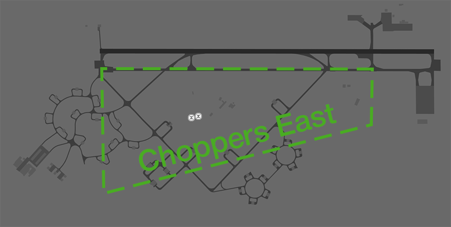

--8<-- "includes/abbreviations.md"

## Manoeuvring Area Responsibility
ADC is responsible for all runways. SMC is responsible for all taxiways, but is not responsible for helicopter movements around the [infield helipads](#helipads)

<figure markdown>
{ width="500" }
  <figcaption>YPTN Manoeuvring Area Responsibility</figcaption>
</figure>

## Circuits
The circuit height is `A015`.

### Circuit Direction
| Runway | Direction |
| ------ | ----------|
| 14     | Right     |
| 32     | Left      |

## Departures
VFR aircraft should expect a visual departure on track to their first tracking point.

IFR aircraft should expect to be issued with a SID as per below:

| Aircraft Type | Runway | First Waypoint | SID |
| --- | --- | --- | --- |
| All | All | DAPMA | DAPMA SID |
| All | All | DN | DN SID |
| All | All | DOSAM | DOSAM SID |
| All | All | GREGA | GREGA SID |
| All | All | LARAB | LARAB SID |
| All | All | MIGAX | MIGAX SID |
| All | All | MILIV | MILIV SID |

All other aircraft may be assigned a visual departure or the TN (RADAR) SID.

## Arrivals
An LOC approach is available to RWY 14. RNP and VOR approaches are available to both runways.

IFR aircraft can generally expect to be processed direct to the IAF for the following approach:

| Runway | Approach |
| --- | --- |
| RWY 14 | RNP |
| RWY 32 | RNP |

VFR aircraft can expect to join the circuit for the most suitable runway.

### Initial and Pitch
The intial points are aligned with Taxiway A at the following locations.

| RWY  | Initial Point | Altitude |
| ---- | ------------- | -------- |
| 14   | 3NM downwind  | `A020`   |
| 32   | 3NM downwind  | `A020`   |

## Special Use Airspace
### Military Gates
There are several military gates established throughout the TN TMA to facilitate entry and exit to adjoining SUA.

| Intended SUA    | TCU Exit Gate       |
| --------------- | ------------------- |
| R225 (and adjacent SUA) | MOROTAI TARAKAN  |
| R226            | MILNE               |
| R238            | WEDGE 1-3           |

!!! note
    Details of each gate can be found in the [Tindal FIHA](https://ais-af.airforce.gov.au/australian-aip).

!!! phraseology
    *CLAS35 plans to enter the R225D restricted area via the MOROTAI gate for military training and airwork.*  
    **CLAS35**: "Tindal Delivery, CLAS35 for MOROTAI, `F120` for R225D, request clearance."  
    **TN ACD**: "RPLC15, Tindal Delivery. cleared MOROTAI direct, climb to `F120`, squawk 6001, departure frequency 120.95."  

### Coded Clearances
Aircraft departing to certain defined groups of SUA may be cleared via a coded clearance.

| Coded Clearance | Restricted Areas |
| --------------- | ---------------- |
| B F M           | R225D, R238, and R250 |
| A C M           | R225B, R225D, R238, and R250 |
| Falconer        | R225D, R225F, R232, R238, and R250 |
| Western         | R225A-F, and R250 |
| Eastern         | R226A and R226B |

!!! note
    Details of each coded clearance can be found in the [Tindal FIHA](https://ais-af.airforce.gov.au/australian-aip).

!!! phraseology
    *CLAS21 plans to operate within R226A and R226B for military training.*  
    **TN ACD**: "CLAS21, cleared Eastern via [MILNE](#military-gates), climb to `F180`, squawk 6003, departure frequency 120.95"
	
## VFR Procedures
VFR aircraft transiting to/from YPTN from the southwest should plan via the [Victoria Highway Corridor](#victoria-highway-corridor).

### Victoria Highway Corridor
A VFR lane is available following the Victoria Highway, allowing aircraft to transit underneath the [R250 restricted area](../../airspace/sua.md#restricted-areas) from north to south (or vice versa). It follows the Victoria Highway southwest of Katherine and is wholly contained within the danger area `SFC-025`. A clearance is **not** required to track via the corridor.

| Direction | Routing | Altitude |
| --- | --- | --- |
| Northbound | WAYS WILE RESC | `SFC-A025` |
| Southbound | RESC WILE WAYS | `SFC-A025` |

Aircraft intending to enter TN CTA require a clearance once clear of the lane.

!!! phraseology
    **ABC**: "Tindal Approach, ABC, Cessna 172 at RESC, `A015`, for YPTN, received A."  
    **TNA**: "ABC, Tindal Approach, squawk 0412, remain outside controlled airspace."   
	**ABC**: "Squawk 0412, remain outside controlled airspace, ABC."   
	  
	**TNA**: "ABC, identified, cleared to YPTN direct, maintain `A015`, QNH 1013."   
	**ABC**: "Cleared to YPTN direct, maintain `A015`, QNH 1013, ABC."

!!! note
    Details of the lane of entry are available on the Tindal VTC.

### Katherine Helicopter Corridor
The Katherine Helicopter Corridor facilitates helicopter movement between private helipads at:

- Katherine Railway Station
- Springvale Homestead
- Moonraker, Katherine Showgrounds
- Katherine Hospital (YXAE)
- Katherine Museum
- Kumbidgee Lodge
- Maude Creek Airstrip (YMUD)
- Katherine Gorge Helipad

It extends 1NM either side of the Victoria Highway from the Katherine Railway Station to the Stuart Highway, then 1NM either side of the Katherine River north to Katherine Gorge.

<figure markdown>
{ width="700" }
  <figcaption>Katherine Helicopter Corridor</figcaption>
</figure>

Helicopters using the corridor to transit between the above approved helipads do not require explicit clearance; clearance is implied by approval to 'report airborne'. 

!!! phraseology
    **XYZ**: "Tindal Approach, helicopter XYZ, at Katherine Showgrounds, for Katherine Gorge."  
    **TNA**: "XYZ, Tindal Approach, report airborne."   
	**XYZ**: "Wilco, XYZ."  
	
Helicopters intending to use the corridor to access any other location need to receive explicit clearance.

!!! phraseology
    **DEF**: "Tindal Approach, helicopter DEF, at Katherine Showgrounds, for the Katherine Country Club."  
    **TNA**: "DEF, Tindal Approach, cleared via helicopter corridor, not above `A010`. Report airborne."   
	**DEF**: "Cleared helicopter corridor, not above `A010`, wilco, DEF." 

## Helicopter Operations
### Helipads
There are two helipads at YPTN, both located near the control tower in the centre of the airfield.

Both helipads are outside of the manoeuvring area so no takeoff or landing clearances will be issued. Instead, helicopters will be instructed to report airborne or report on the ground.

!!! phraseology 
    **TN ADC**: "CHOP31, Pad 1, report on the ground" 

### Choppers East
Helicopters perform circuits within '**Choppers East**', defined as an area between Taxiway Alpha the Old Stuart Highway, and the runway thresholds.

<figure markdown>
{ width="700" }
<figcaption>Choppers East</figcaption>
</figure>

Helicopters requesting clearance to operate in the Eastern Grass shall be cleared to air transit to, and then operate within, the area by ADC.

!!! phraseology
    **CHOP12**: "Tindal Tower, CHOP12 ZXY, Pad 1, for circuits, ready."   
    **TN ADC**: "CHOP12, Tindal Tower. Cleared to operate Choppers East not above `A010`. Report airborne."

### Katherine
Helicopters operating in the vicinity of Katherine shall utilise the [Katherine Helicopter Corridor](#katherine-helicopter-corridor).