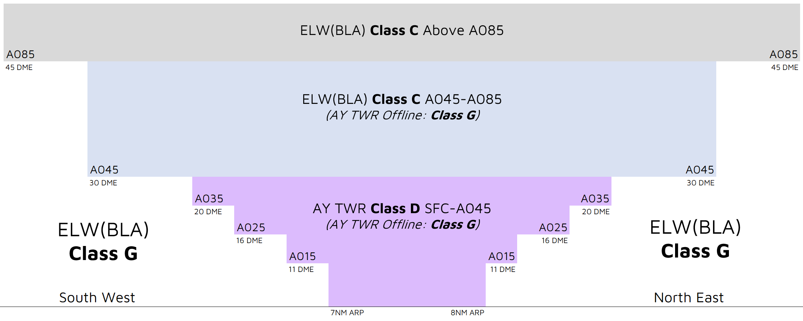

--8<-- "includes/abbreviations.md"

## Airspace
AY ADC is responsible for the Class D airspace in the AY CTR `SFC` to `A045`.

<figure markdown>
{ width="700" }
  <figcaption>AY ADC Airspace</figcaption>
</figure>

### Tower Closed Proceedures
When AY ADC is closed, the Class C & D airspace from `SFC` to `A085` is reclassified as Class G.

## Departures
VFR aircraft should expect to depart via a visual departure, on track to their first tracking point.

IFR aircraft should expect to be issued with a SID as per below:

| Aircraft Type | Runway | First Waypoint | SID |
| --- | --- | --- | --- |
| All | All | DUGGI | DUGGI SID |
| All | All | UGVER | UGVER SID |

All other aircraft shall expect to depart via a [pilot-managed](../../navigation/ifrdepartures.md#other-departure-methods) IFR departure or **visual departure**.

## Arrivals
RNP and VOR approaches are available to both runways. An RNP(AR) approach is available to RWY 07.

IFR aircraft can generally expect to be processed via a STAR, or direct to the IAF, for the most suitable (or requested) approach.