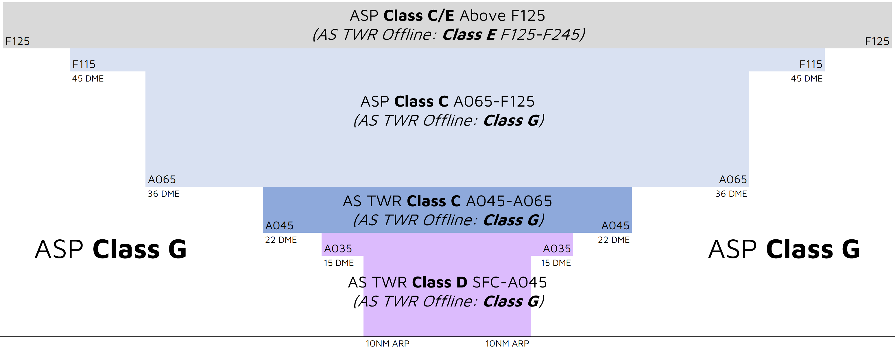
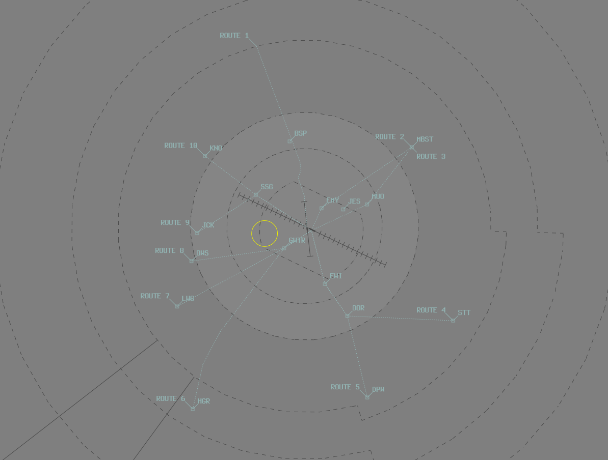

--8<-- "includes/abbreviations.md"

## Airspace
AS ADC is responsible for the Class D airspace in the AS CTR `SFC` to `A045`, as well as the Class C airspace from `A045` to `A065`.

<figure markdown>
{ width="700" }
  <figcaption>AS ADC Airspace</figcaption>
</figure>

### Tower Closed Proceedures
When AS ADC is closed, the Class C & D airspace from `SFC` to `F125` is reclassified as Class G.

## Departures
VFR aircraft should expect to depart via a visual departure, on track to their first tracking point or in accordance with a [VFR Route](#vfr-routes).

IFR aircraft should expect to be issued with a SID as per below:

| Aircraft Type | Runway | First Waypoint | SID |
| --- | --- | --- | --- |
| All | All | DESET | DESET SID |
| All | All | DIGLA | DIGLA SID |
| All | All | ELLOW | ELLOW SID |
| All | All | GAFER | GAFER SID |
| All | All | HONGI | HONGI SID |
| All | All | IDANU | IDANU SID |
| All | All | KALUG | KALUG SID |
| All | All | LUGSA | LUGSA SID |
| All | All | MATMA | MATMA SID |
| All | All | PULOL | PULOL SID |
| All | All | PUMAK | PUMAK SID |
| All | All | RUPUS | RUPUS SID |
| All | All | SADEL | SADEL SID |
| All | All | SOTMI | SOTMI SID |
| All | All | TNK | TNK SID |
| All | All | TUMSO | TUMSO SID |

All other aircraft shall expect to depart via a [pilot-managed](../../navigation/ifrdepartures.md#other-departure-methods) IFR departure or **visual departure**.

## Arrivals
An ILS approach is available to RWY 12. RNP, RNP(AR), and VOR approaches are available to RWY 12 and 30. An NDB approach is available to the circling area.

IFR aircraft can expect to be processed direct to the IAF for the most suitable (or requested) approach.

## VFR Routes
Alice Springs has 10 VFR routes that follow prominent geographic features and highways. These established routes begin at various reporting points, providing entry to the circuit area. VFR Routes 8 and 9 provide separation from R215 Pine Gap.

<figure markdown>
{ width="650" }
  <figcaption>YBAS VFR Routes</figcaption>
</figure>

!!! phraseology 
    **SDA**: "Alice Tower, Cirrus SDA, DPW, `A065`, inbound, received J, request clearance"  
    **AS ADC**: "SDA, Alice Tower, cleared to YBAS via VFR Route 5, maintain `A065`"  
    **SDA**: "Cleared to YBAS via VFR Route 5, maintain `A065`, SDA"  

!!! tip
    You can find details of all VFR Routes on the [Alice Springs / Uluru VTC](https://www.airservicesaustralia.com/aip/aip.asp){target=new}.