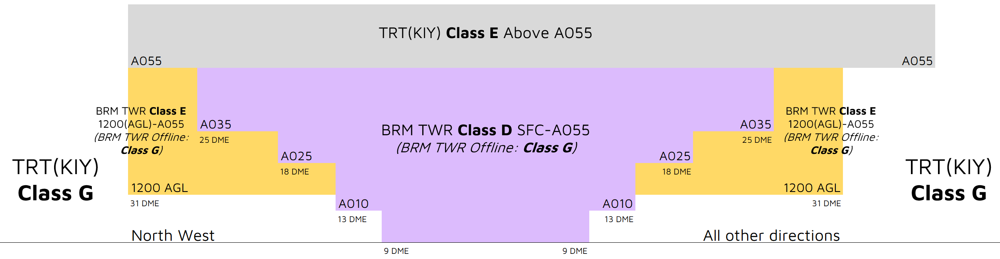

--8<-- "includes/abbreviations.md"

## Airspace
BRM ADC is responsible for the Class D airspace `SFC` to `A055`, as well as the Class E airspace `1200ft AGL` to `A055`, within the BRM CTR.

<figure markdown>
{ width="700" }
  <figcaption>BRM ADC Airspace</figcaption>
</figure>

### Tower Closed Proceedures
When BRM ADC is closed, the Class D & E airspace from `SFC` to `A055` is reclassified as Class G.

## Departures
VFR aircraft should expect to depart via a visual departure, on track to their first tracking point.

IFR aircraft shall expect to depart via a [pilot-managed](../../navigation/ifrdepartures.md#other-departure-methods) IFR departure or **visual departure**.

A [Category H](../../flight-planning/alternaterequirements.md#aircraft-categories) SID exists to facilitate the departure of IFR helicopters.

## Arrivals
RNP, RNP(AR) and NDB approaches are available to both runways.

IFR aircraft can expect to be processed direct to the IAF for the most suitable (or requested) approach.

A [Category H](../../flight-planning/alternaterequirements.md#aircraft-categories) RNP approach exists to facilitate the arrival of IFR helicopters.