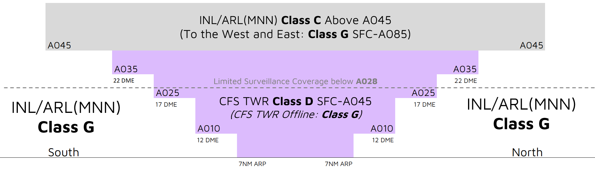

--8<-- "includes/abbreviations.md"

## Airspace

<figure markdown>
{ width="700" }
  <figcaption>CFS ADC Airspace</figcaption>
</figure>

CFS ADC is responsible for the Class D airspace in the CFS CTR `SFC` to `A045`.