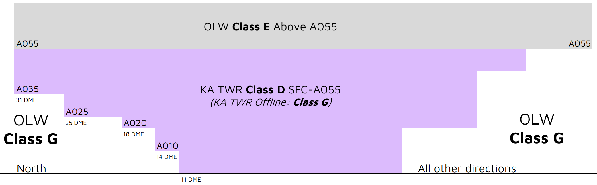

--8<-- "includes/abbreviations.md"

## Airspace
KA ADC is responsible for the Class D airspace in the KA CTR `SFC` to `A055`.

<figure markdown>
{ width="700" }
  <figcaption>KA ADC Airspace</figcaption>
</figure>

### Tower Closed Proceedures
When KA ADC is closed, the Class D airspace from `SFC` to `A055` is reclassified as Class G.

## Departures
VFR aircraft should expect to depart via a visual departure, on track to their first tracking point.

IFR aircraft shall expect to depart via a [pilot-managed](../../navigation/ifrdepartures.md#other-departure-methods) IFR departure or **visual departure**.

## Arrivals
RNP, RNP(AR) and VOR approaches are available to both runways. NDB approaches are available to RWY 08.

IFR aircraft can expect to be processed direct to the IAF for the most suitable (or requested) approach.