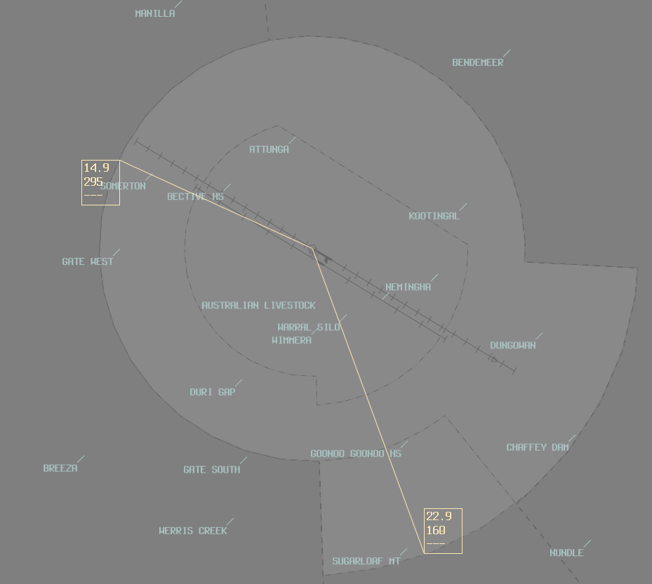

--8<-- "includes/abbreviations.md"

## Runway Modes
Equal preference is shared between runways 12L/R and 30L/R.

Runway 12R/30L shall be used for:

- All single-engine VFR arrivals and departures from the 160 Radial through West to the 295 Radial
- Arrivals via DUA
- Departures via GST or GWT
- Single-engine circuit training

Runway 12L/30R shall be used for all other operations. 

## Dual ADC operations
When ADC South is Online, they are responsible for the airspace between the **TW** 160 Radial, West through to the 295 Radial.

<figure markdown>
{ width="600" }
  <figcaption>TW Dual ADC Airspace</figcaption>
</figure>
