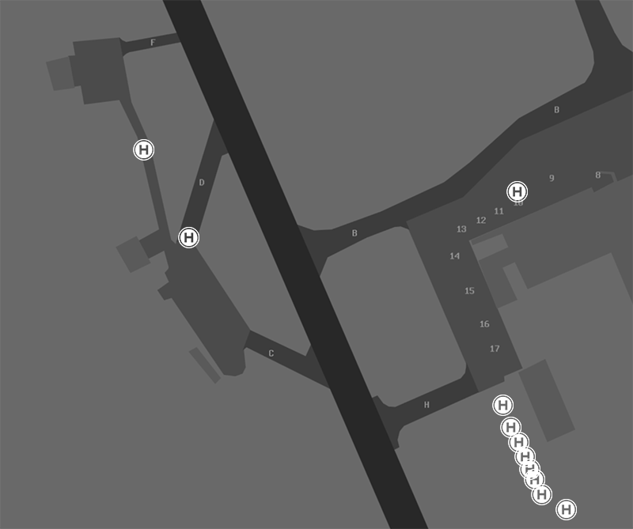
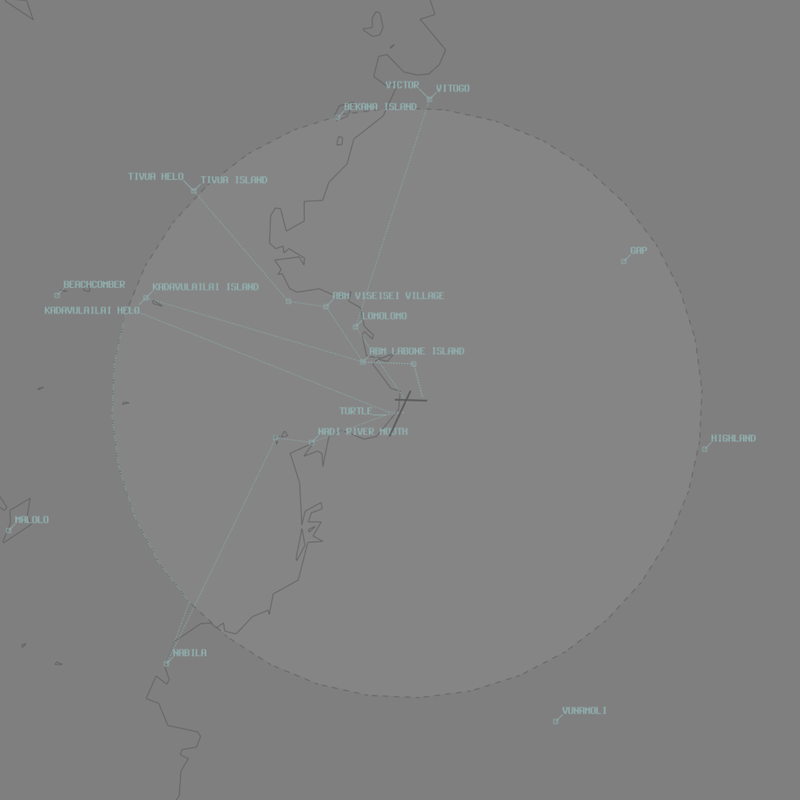

--8<-- "includes/abbreviations.md"

## Airspace
**NFFN ADC** is responsible for the Class D airspace from `SFC` to `A025` within a 10nm radius.

## Taxiing
**NFFN ADC** is responsible for Taxiway C, D, and F, as well as the grass area east of H.

**Taxiway B** south of Taxiway G is restricted to Code C aircraft. **Taxiway H** is restricted to aircraft no larger than AT72.

## Departures
Due to terrain, the preferred runway for departures is RWY 20. Most international aircraft will require RWY 02/20 in most conditions, although medium category aircraft and below may be assigned RWY 27. 

### Departure Procedures
VFR aircraft should plan via a [departure gate](#departurearrival-gates).

IFR aircraft planned via **TUTRI**, **KABAR**, **BIDNA**, **LATIT**, **PACKO**, **MAKSO**, **GODAP**, **LUPLO**, **EXORA**,**NA**, **NAVUA**, **AGTOS**, **BEACH**, **ALBAB**, **TEPEK**, **VIPOB** shall expect to be issued a procedural SID. All other aircraft shall expect a **visual departure** or **radar** SID. 

## Arrivals
The preferred runway for arrivals is RWY 02. Medium category aircraft and below may be assigned RWY 09/27. 

### Arrival Procedures
An ILS and NDB approach is available to RWY 02. An RNP approach is available to RWY 02 and 09. An RNP(AR) approach is available to RWY 20. A VOR approach is available to the circling area.

VFR aircraft should plan via an [arrival gate](#departurearrival-gates).

## Night Operational Restrictions
Due to the surrounding mountainous terrain, the following restrictions are applied at night:

- **RWY 20** is only available to aircraft flying the **RNP AR** approach. Visual approaches are not permitted.
- **RWY 09** is not available for departures.
- **RWY 27** is not available for arrivals.

## Helicopter Operations
VFR helicopters should plan via a [VFR transit lane](#vfr-transit-lanes). IFR helicopters should conform to fixed wing operations and expect a radar departure, or visual departure if conditions allow.

All helipads at NFFN are uncontrolled. Pilots will **not** receive an explicit takeoff or landing clearance. Instead, they will be instructed to *'report airborne'* or *'report on the ground'*.

<figure markdown>
{ width="600" }
  <figcaption>NFFN Helipads</figcaption>
</figure>

## VFR Operations
### Departure/Arrival Gates
Aircraft should report at the standard VFR Departure/Arrival Gates.

<figure markdown>
{ width="500" }
  <figcaption>NFFN VFR Departure/Arrival Gates</figcaption>
</figure>

| Direction from NFFN | Name | Dep/Arr |
| ------------------- | ---- | ------- |
| North | Vitogo | Both |
| North | Bekana Island | Both |
| Northeast | Gap | Both |
| Northeast | Highland | Both |
| Southeast | Vunamoli | Both |
| Southwest | Nabila | Both |
| West | Kadavulailai Island | Both |
| West | Beachcomber | Both |
| Northwest | Tivua Island | Both |

### VFR Transit lanes
VFR transit lanes are established to allow aircraft to transit through the NFFN CTR, by day.

| VFR Route Name | Description | Altitude |
| ------ | ------- | ------ |
| FJV1 Turtle | Seaplane Base-Abeam Kadavulailai Island, then along CTR boundary to Nabila-Yakuilau-Nadi River Mouth, then along coast back to Seaplane Base | `SFC` to `A005` |
| FJV2 Victor | NFFN-Lololomo Beach-Vitogo | `A050` to `A015` |
| FJV4 Kadavulailai Helicopter Lane | Heliport-The Bridge-ABM Labone Island-Kadavulailai Island | `SFC` to `A005` |
| FJV5 Tivua Helicopter Lane | Heliport-The Bridge-ABN Labone Island-ABM Viseisei Village-ABM Vuda Marina-Tivua Island | `SFC` to `A005` |

### Tiliva Training Area
The Tiliva Training Area is established north of the NFFN CTR, from `A005` to `A040`, and is activated upon pilot request.

Aircraft transiting between the NFFN CTR and the training area should track inbound/outbound via Vitogo.