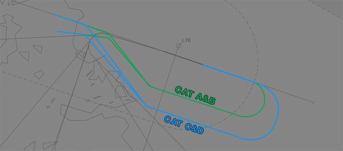
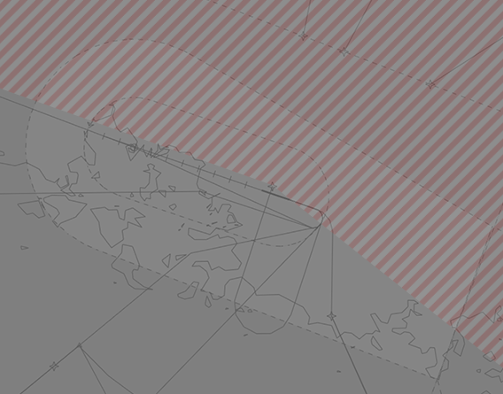

--8<-- "includes/abbreviations.md"

## Taxiing
Aircraft up to, and including, B738s and A320s are permitted to turnaround on the runway at any intermediate point. Other aircraft must backtrack the entire length.

## Runway Modes
Typically reciprocal runway operations occur with **RWY 29** departures and **RWY 11** arrivals. If weather or traffic levels preclude reciprocal runway operations RWY 11 shall be used for arrivals and departures, except where excessive tailwind necessitates the use of RWY 29.

## Departures
Aircraft planned via **GOPRA**, **ONIBA**, **TEPAM**, **NISAS**, **POXAK**, **SCUBA**, or **VIRAR** should expect to be assigned the **Procedural SID** that terminates at the appropriate waypoint. Aircraft departing to the north-east should expect to be assigned the **Procedural SID** terminating at **LTO VOR**.

## Arrivals
ILS, RNP, VOR, and NDB approaches are available to RWY 11. An RNP approach is available to RWY 29.

### Runway 29 VPT
Aircraft arriving via the **VPT** for RWY 29 will perform an **ILS** or **VOR** approach for RWY 11 before breaking right to follow the prescribed visual track.

<figure markdown>
{ width="700" }
</figure>

## VFR Operations
### Departures
VFR departures should advise their planned departure point and requested alitude to **NWWW SMC** with *taxi* call, and **NWWW ADC** with *ready* call. Departures will climb to at least `A015` (or `RFL`, if lower) in the circuit before tracking to their departure point.

!!! phraseology  
    **FOXYZ:** "Tontouta Ground, FOXYZ, Cessna 152, parking P2, information A, request taxi VFR to Koumac, via WA."  
    **NWWW SMC:** "FOXYZ, Tontouta Ground, squawk 7001, expect to exit control zone via WA. Taxi holding point C, Runway 29. Report ready for departure.  
    **FOXYZ:** "Squawk 7001, expect WA exit. Taxi holding point C, Runway 29. FOXYZ"

### Arrivals
VFR aircraft should report inbound at a VFR reporting point. NWWW ADC will instruct aircraft to join the appropriate leg of the aerodrome circuit.

### VFR Reporting Points
| Code | Name (French) | Name (English) |
| ---- | ------------- | -------------- |
| EA | Réservoirs | Tanks |
| M | Pointe Maa | Maa headland |
| NB | Pont de la Tontouta | La Tontouta Bridge |
| NA | Col de Nassirah | La Nassirah Pass |
| PD | Passe de Dumbéa | Dumbéa Pass |
| S | Presqu'île de Uitoé | Uitoé Peninsula |
| SH | Sud Savannah | South Savannah |
| WA | Ouaméni | Ouaméni |
| WB | Entrée de Boulouparis | Boulouparis entry |
| Y | Ile Puen | Puen Island |

### Night Operations
At night, VFR aircraft are prohibited from performing a visual approach when arriving from the north, between **LTO VOR** radials 290° to 128°.

<figure markdown>
{ width="600" }
</figure>