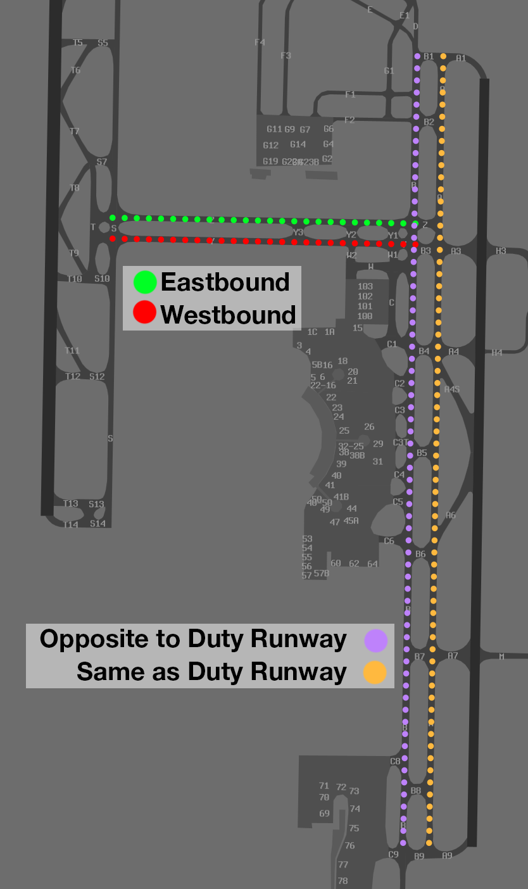
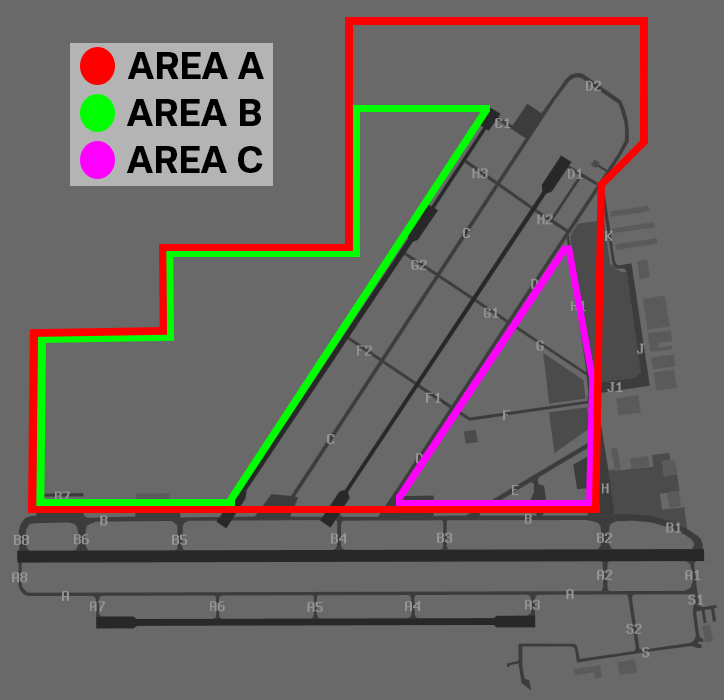

---
<<<<<<< HEAD
  title: Brisbane, QLD (WIP)
=======
  title: Brisbane, QLD (TODO)
>>>>>>> e30813e2bcd52285cfbef8ae0948e6c032a21982
---

--8<-- "includes/abbreviations.md"

<<<<<<< HEAD
## Aerodomes
### Brisbane (YBBN)
#### Standard Taxi Routes

Standard taxi routes exist to simplify issued taxi instructions. Unless explicit instructions are received, the following taxiways should be used in the directions indicated below:

| Taxiway | Direction of Travel |
| ------- | ------------------- |
| Bravo | Opposite to Duty Runway |
| Alpha | Same Direction as Duty Runway |
| Yankee | Westbound |
| Zulu | Eastbound |

<figure markdown>
{ width="450" }
    <figcaption>Brisbane Standard Taxi Routes</figcaption>
</figure>

!!! warning "Important"
    SMC may provide instructions which contradict these standard taxi routes. Ensure you comply with any issued taxi instruction at all times.

#### SMC Frequency Change

There are three SMC positions at Brisbane, all with different jurisdiction. Aircraft can be expect to hold short of predetermined taxiways. Domestic aircraft should independently transfer to the next SMC controller autonomously, while international aircraft may expect an explicit frequency change from the current SMC.

#### Helicopter Operations
- Clearance requirements from ATS
- VMC Inbound & Outbound waypoints based on direction of flight
- Expectation of requirement to report airborne/on the ground, not issued a takeoff/landing clearance (unless using H2)

### Gold Coast (YBCG)
#### Airspace
Gold Coast is a Class C aerodome with CTR from `SFC` to `A015`.

### Sunshine Coast (YBSU)
#### Airspace
Sunshine Coast is a procedural Class D aerodrome with CTR from `SFC` to `A035`.

### Archerfield (YBAF)
#### Airspace
Archerfield is a Class D aerodrome with CTR from `SFC` to `A015`.

#### Maneuvering Area
- Where you require clearance (apron area, maneuvering area)
- custom image
- 2 main helicopters, (north / central) inside maneuvering area clearance to become airborne is required, anywhere else = report airborne / on ground

#### Taxi Procedures
- runup bays, H outbound J inbound, cross 04L, 04R
Aircraft 

!!! note "Format"
    "ATC Unit, Aircraft Type, Callsign, POB, ATIS,
    Location, Intentions "

!!! example
    **BHK**: "Archer Ground, Archer BHK, Duel, received Delta, at Eastern Apron, request taxi for eastern departure"  
    **AF SMC**: "BHK, Archer Ground, taxi Echo, Bravo, cross runway 04R, 04L, to the 10L runup bay, report runups complete"    
    **BHK**: "Taxi Echo, Bravo, cross runway 04R, 04L, to the 10L runup bay, report runups complete"  

!!! warning
    In some simulator scenery holding point **B6** is incorrect or entirely missing, when assigned holding point **B6**, immediately confirm you can accept it. If not, advise the controller straight away.

#### Outbond Procedures
- track xxx degrees
- depart the zone at 1000
- no frequency change required once leaving CTR

!!! note "Format"
    "ATC Unit, Callsign, Ready, Runway,
     Intentions "  

!!! example
    **R8489**: "Archer Tower, R8489, ready, runway 10L, for eastern departure"  
    **AF ADC**: "R8489, Archer Tower, runway 10L, cleared for takeoff"      
    **R8489**: "Runway 10L, cleared for takeoff, R8489"  

| Planned Departure Tracks | "Intentions"   | Tracking Requirement | 
| ---------------      | ---------      | ----------           | 
| BTN 310 & 019 DEG    | Northern Departure | Track via WTBG | 
| BTN 020 & 099 DEG    | Eastern   Departure  | Track via Gateway Motorway and Pacific Motorway Intersection *(Not available when Rwy 22 active unless departing into Class C)* | 
| BTN 100 & 204 DEG    | Southern Departure | Track 135 until clear of the zone |
| BTN 205 & 309 DEG    | Western Departure  | Track between 220 & 309 until clear of the zone *(Acft must nominate outbound DEP track with TAXI call)* |
| Other                |                    | As approved by ATC

#### Inbound Procedures
- inbound reporting points, alt, etc
- circuit join / alt / report point instructions
- phraselogy example, (cleared visual approach for 10L via TAR, etc)

!!! note "Format"
    "ATC Unit, Callsign, Aircraft Type, Location, Altitude, ATIS, Intentions "  

!!! example
    **YQB**: "Archer Tower, YQB, Cirrus, Target, A015, recieved Bravo, inbound fullstop"  
    **AF ADC**: "YQB, Archer Tower, join downwind, runway 10L, maintain A015"      
    **YQB**: "Join downwind, runway 10L, maintain A015, YQB"  

#### Helicopter Operations

Archerfield has three helipads located around the aerodrome:

- **Central Helipad**, on the southern side of Taxiway Foxtrot
- **Northern Helipad**, adjacent the north-eastern end of Runway 04R/22L
- The **Queensland Government Air facility** used by rescue helicopters, north of Taxiway B5

##### Training Areas

There are 3 designated helicopter training areas which can be used for training operations in ground effect and circuits. The active helicopter training area shall be nominated on the ATIS.

=== "Area A"

    | Lateral Boundary | Vertical Limit  | Capacity     |
    | ------| ---- | --------|
    | North of Taxiway B within the confines of the aerodrome boundary, clear of all buildings  | Not above `A005`  | 3 helicopters in the circuit area, and additionally 2 helicopters in ground effect  |

=== "Area B"

    | Lateral Boundary | Vertical Limit  | Capacity     |
    | ------| ---- | --------|
    | North and west of Runway 04L within the confines of the aerodrome boundary, clear of all buildings  | Not above `A005`  | 3 helicopters in the circuit area, and additionally 2 helicopters in ground effect  |

=== "Area C"

    | Lateral Boundary | Vertical Limit  | Capacity     |
    | ------| ---- | --------|
    | South and east of Taxiway D, inside the fixed   wing circuit for Runway 04R/22L, east of the   control tower, *All landings to be conducted north of Taxiway B*  | Not above `A008`  | 2 helicopters  |

<figure markdown>
{ width="500" }
    <figcaption>Archerfield Helicopter Training Areas</figcaption>
</figure>

##### Departures

##### Arrivals

#### Circuits

| Runway | Day  | Night |
| ----------------| --------- | ---------- |
| 04R             | Right | -  |
| 04L             | Left  | -  |
| 22R             | Right | -  |
| 22L             | Left  | -  |
| 10R             | Right | -  |
| 10L             | Left  | Left  |
| 28R             | Right | Right |
| 28L             | Left  | -  |

All circuits are to be flown at `A010`.

- tip: for more information refer to Radio Telephony

### VFR Procedures
#### Brisbane City Scenic

!!! phraseology
    **CALLSIGN**: "ATC, CALLSIGN"  
    **ATC**: "CALLSIGN, ATC"  
    **CALLSIGN**: ", CALLSIGN"  

#### Univat Route
=======
## Aerodromes
### Brisbane (YBBN)
- SMC splits
- Heli ops

### Gold Coast (YBCG)
- VFR route

### Sunshine Coast (YBSU)

### Archerfield (YBAF)
- Helicopter training areas
- Inbound/outbound procedures
>>>>>>> e30813e2bcd52285cfbef8ae0948e6c032a21982
