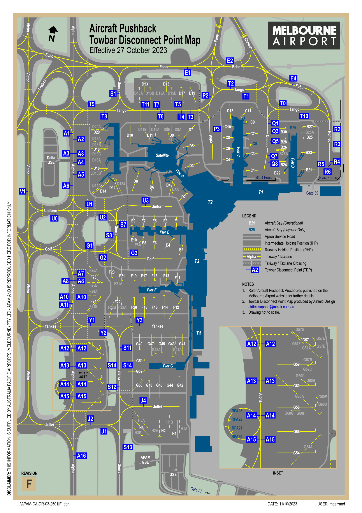

--8<-- "includes/abbreviations.md"

## Aerodromes
### Melbourne (YMML)
#### Pushback Disconnect Points
Towbar disconnect points are used to expedite traffic flow and provide separation assurance between aircraft operating on the apron. Third-party simulator plugins may be necessary to customise your pushback and utilise a published disconnect point. For that reason, they are **not** used by default. However, ATC may ask whether you are capable of towing to a disconnect point and provide the instruction where it would benefit the flow of traffic.

<figure markdown>
{ width="500" }
    <figcaption>Melbourne Disconnect Points Map</figcaption>
</figure>

!!! phraseology
    **QFA728**: "Melbourne Ground, QFA728, received November, bay Charlie 11, request pushback"  
    **ML SMC**: "QFA728, pushback approved, disconnect point Tango 10"  
    **QFA728**: "Pushback approved, disconnect point Tango 10, QFA728"

#### Standard Taxi Routes
Standard taxi routes exist to simplify issued taxi instructions. Unless explicit instructions are received, the following taxiways should be used in the directions indicated below:

| Taxiway | Direction of Travel |
| ------- | ------------------- |
| Alpha | Opposite to Duty Runway |
| Victor | Same Direction as Duty Runway |

<figure markdown>
{ width="600" }
    <figcaption>Melbourne Standard Taxi Routes</figcaption>
</figure>

!!! example
    With runway 34 in use, taxiway Alpha would be used for aircraft taxiing southbound and taxiway Victor would be used for aircraft taxiing northbound.

!!! warning "Important"
    SMC may provide instructions which contradict these standard taxi routes. Ensure you comply with any issued taxi instruction at all times.

#### LAHSO (TODO)
- Description of LAHSO
- Pilot requirements
- Advising of inability to comply

### Moorabbin (YMMB)
#### Airspace
YMMB is a Class D aerodrome, with jurisdiction over the Class D airspace from `SFC`to `A025` within a 3nm radius.

#### Start Approval
Start approval is required for:

- Circuit operations
- Airwork in the Melbourne TMA
- Departures to YMML
- Departures to YMEN planned above A020

#### Taxi Procedures
The runup bays are outside the manoeuvring area, so no taxi instructions are required for initial taxi.

!!! tip
    The YMMB Manoeuvring Area chart can be found on the [CASA Website](https://www.casa.gov.au/moorabbin-manoeuvring-area-map).

Departing aircraft must obtain taxi instructions from SMC prior to leaving the run up bays. Aircraft which do not require run ups must obtain taxi instructions prior to entering the manoeuvring area.

!!! phraseology
    **VCY**: "Moorabbin Ground, VCY, Cessna 152, Southern Runup Bay, for an upwind departure, received Uniform, request taxi"  
    **MB SMC**: "VCY, Moorabbin Ground, taxi to holding point Golf 2, runway 17R"  
    **VCY**: "Taxi to holding point Golf 2, runwy 17R, VCY"

#### Outbound Procedures
Unless in receipt of an airways clearance into the overlying Melbourne Class C airspace, departing aircraft shall depart the zone via an extended circuit leg at `A020`.

#### Inbound Procedures
Inbound aircraft shall report overhead a published inbound reporting waypoint at `A015`.

!!! phraseology
    **KOT**: "Moorabbin Tower, KOT, Cessna 172, Carrum, `A015`, inbound, received Victor"  
    **MB ADC**: "KOT, Moorabbin Tower, join downwind runway 17L"  
    **KOT**: "Join downwind runway 17L, KOT"

## VFR Procedures
### Melbourne Coastal Route
A designated VFR route is established on the shores of Port Phillip Bay. This route is flown below the base of controlled airspace and an airways clearance is not required. Details of the route can be found on the Melbourne VTC. Pilots should make appropriate broadcasts on the advisory frequency, so as to remain clear of other aircraft operating on the route.

!!! tip
    The Melbourne VTC can be found on the [AIP Website](https://www.airservicesaustralia.com/aip/aip.asp).

Recommended altitudes have been established to segregate opposite direction traffic, as per below:

<table>
    <thead>
        <tr>
            <th>Route Segment</th>
            <th>Direction of Travel</th>
            <th>Recommended Altitude</th>
        </tr>
    </thead>
    <tbody>
        <tr>
            <td rowspan="2">Laverton BOM Tower to Point Ormond</td>
            <td>Eastbound</td>
            <td>A015</td>
        </tr>
        <tr>
            <td>Westbound</td>
            <td>A020</td>
        </tr>
        <tr>
            <td rowspan="2">Port Ormond to Carrum</td>
            <td>Southbound</td>
            <td>A015</td>
        </tr>
        <tr>
            <td>Northbound</td>
            <td>A025</td>
        </tr>
    </tbody>
</table>

Keep to the right side of the lane to avoid oncoming traffic and ensure you avoid the Moorabbin CTR.

### Melbourne City Orbits
Visual orbits of the CBD in the overlying Class C airspace are available on request. The airspace over the CBD is managed by **Essendon ADC**, or **Melbourne TCU** when the Tower is closed.

Pilots can expect a clearance at `A015` by day or `A022` by night.

!!! phraseology
    **VCY**: "Essendon Tower, VCY, Cessna 152, 2nm south of WMS, A015, received Lima, request one left-hand city orbit"  
    **EN ADC**: "VCY, Essendon Tower, cleared one left-hand orbit, maintain A015, report clear of the zone" 
    **VCY**: "Cleared one left-hand orbit, maintain A015, VCY"  

    *Once clear of the Class C CTR*  
    **VCY**: "VCY, clear of the zone"  
    **EN ADC**: "VCY, identification and control services terminated, squawk 1200, frequency change approved"  
    **VCY**: "Squawk 1200, frequency change approved, VCY"

## !! To Do !!
- sunbury corridor
- visual STARs to YMML
- YMEN tower closed procedures