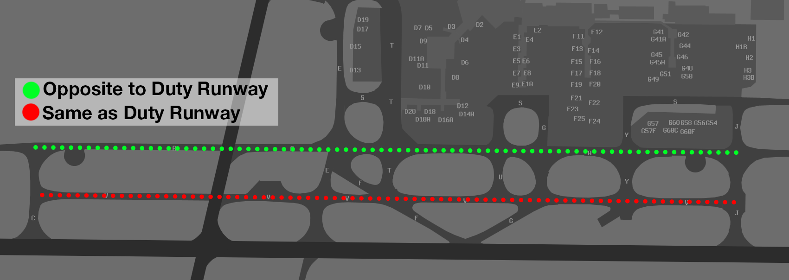

--8<-- "includes/abbreviations.md"

## Melbourne (YMML)
### Taxiing
#### Standard Taxi Routes
Standard taxi routes exist to simplify issued taxi instructions. Unless explicit instructions are received, the following taxiways should be used in the directions indicated below:

| Taxiway | Direction of Travel |
| ------- | ------------------- |
| Alpha | Opposite to Duty Runway |
| Victor | Same Direction as Duty Runway |

<figure markdown>
{ width="600" }
    <figcaption>Melbourne Standard Taxi Routes</figcaption>
</figure>

!!! example
    With runway 34 in use, taxiway Alpha would be used for aircraft taxiing southbound and taxiway Victor would be used for aircraft taxiing northbound.

!!! warning "Important"
    SMC may provide instructions which contradict these standard taxi routes. Ensure you comply with any issued taxi instruction at all times.

### Departures
VFR aircraft should expect to depart via a visual departure, on track to their first tracking point.

IFR aircraft should expect to be issued with a SID as per below:

| Aircraft Type | Runway | First Waypoint | SID |
| --- | --- | --- | --- |
| Jets | All | CORRS | CORRS SID |
| Jets | All | CRENA | CRENA SID |
| Jets | All | DOSEL | DOSEL SID |
| Jets | All | ESDIG | ESDIG SID |
| Jets | All | KEPPA | KEPPA SID |
| Jets | All | MNG | MNG SID |
| Jets | All | NONIX | NONIX SID |
| Jets | All | PEDNI | PEDNI SID |
| Jets | All | SUNTI | SUNTI SID |

All other aircraft shall expect the **ML (RADAR) SID**.

!!! note
    With RWY 27 nominated as the duty departure runway, aircraft requiring the use of RWY 16 for the west or north should expect to be issued with the ISPEG SID.

#### Pushback Disconnect Points
Towbar disconnect points are used to expedite traffic flow and provide separation assurance between aircraft operating on the apron.

!!! warning "Important"
    Third-party simulator plugins may be necessary to customise your pushback and utilise a published disconnect point. For that reason, they are **not** used by default. However, ATC may ask whether you are capable of towing to a disconnect point and provide the instruction where it would benefit the flow of traffic.

<figure markdown>
{ width="500" }
    <figcaption>Melbourne Disconnect Points Map</figcaption>
</figure>

!!! phraseology
    **QFA728**: "Melbourne Ground, QFA728, received November, bay Charlie 11, request pushback"  
    **ML SMC**: "QFA728, pushback approved, disconnect point Tango 10"  
    **QFA728**: "Pushback approved, disconnect point Tango 10, QFA728"

### Arrivals
An ILS is available to RWY 16 and RWY 27. RNP and GLS approaches are available to all runways. RNP(AR) approaches are available to RWY 16. VOR approaches are available to RWY 09, RWY 27 and RWY 34.

IFR aircraft can generally expect to be processed via a STAR terminating with the following approach:

| Runway | Approach |
| --- | --- |
| 09 | RNP |
| 16 | ILS |
| 27 | ILS |
| 34 | RNP |

With RWY 34 in use, aircraft from the northeast may be cleared via the Victor STAR for a visual approach. Refer to the relevant chart and be aware of the tight turn from base to final. Careful planning and speed control is necessary to avoid overshooting final.

### Preferred Runway Exits
The AIRPORT EFFICIENCY PROCEDURES chart dictates preferred runway exits for pilots to vacate at. This ensures a predictable, efficient movement of aircraft on the aerodrome and should be abided by where possible. Where a preferred exit is not assured, pilots must inform ADC.

| Runway | Aircraft Type | Preferred Exits |
| --- | --- | --- |
| RWY 09 | Turboprop Other | A P, otherwise Q |
| RWY 16 | All | G, otherwise E or J |
| RWY 27 | All Heavy | N M |
| RWY 34 | All | F, otherwise E or C |

### LAHSO
LAHSO is the independent operation of two crossing runways for arrivals and departures. It is a complicated procedure which is rarely used, but occassionally run during VATPAC's busiest events featuring YMML. Strict pilot requirements apply during LAHSO.

The **active** aircraft is the landing aircraft issued with a hold short instruction, prohibiting them from rolling out on their assigned runway beyond the intersection with the crossing runway.

The **passive** aircraft is the landing or departing aircraft which has full use of their assigned runway.

YMML operates LAHSO using **RWY 27** as the passive runway and **RWY 34** as the active runway.

#### Pilot Requirements
All Australian registered aircraft operating under a flight number callsign are assumed to be **approved active participants**. If a pilot is unable to participate, ATS must be informed no later than 120nm from the destination aerodrome.

!!! phraseology
    **VOZ852**: "VOZ852, negative active LAHSO"  
    **BLA**: "VOZ852"

Other pilots who wish to participate must notify ATS no later than 200nm from the destination aerodrome.

!!! phraseology
    **ANZ1984**: "Brisbane Centre, ANZ1984, maintaining FL360, LAHSO approved"  
    **BLA**: "ANZ1984, Brisbane Centre"

Pilots who are unable to participate actively will be sequenced as a passive aircraft. Pilots who are unable to participate at all will be sequenced for an independent approach.

## Moorabbin (YMMB)
### Airspace
MB ADC is responsible for the Class D airspace in the MB CTR from `SFC`to `A025`.

When Moorabbin ADC West is online, responsibility for the Runway, Circuit, and Airspace is divided between the two ADC controllers.

**ADC East** takes responsibility for the East Runway, Circuit and Airspace (Runway 17L/35R and 13L/31R).

**ADC West** takes responsibility for the West Runway, Circuit and Airspace (Runway 17R/35L and 13R/31L).

### Taxiing
The runup bays are outside the manoeuvring area, so no taxi instructions are required for initial taxi.

!!! tip
    The YMMB Manoeuvring Area chart can be found on the [CASA Website](https://www.casa.gov.au/moorabbin-manoeuvring-area-map).

Departing aircraft must obtain taxi instructions from SMC prior to leaving the run up bays. Aircraft which do not require run ups must obtain taxi instructions prior to entering the manoeuvring area.

!!! phraseology
    **VCY**: "Moorabbin Ground, VCY, Cessna 152, Southern Runup Bay, for an upwind departure, received Uniform, request taxi"  
    **MB SMC**: "VCY, Moorabbin Ground, taxi to holding point Golf 2, runway 17R"  
    **VCY**: "Taxi to holding point Golf 2, runwy 17R, VCY"

### Departures
VFR aircraft shall generally depart the zone on an extended circuit leg at `A020`.

There are no SIDs at YMMB. IFR or VFR aircraft requesting climb into the overlying or adjacent Class C airspace must obtain an airways clearance from SMC.

#### Start Approval
Start approval is required from SMC for:

- Circuit operations
- Airwork in the Melbourne TMA
- Departures to YMML
- Departures to YMEN planned above `A020`

### Arrivals
VFR aircraft shall approach the MB CTR at `A010` and report at BTO, ACE, GMH, CARR, SHOL, or BAW.

Pilots should expect circuit joinining instructions in accordance with the table below:

| Entry Point | RWY 13                          | RWY 17                          | RWY 31                          | RWY 35                          |
|-------------|---------------------------------|----------------------------------|----------------------------------|----------------------------------|
| BTO         | *Final* **13R**                  | *Oblique Base* **17R**            | *Downwind* **31L**                | *Downwind* or *Oblique Downwind* **35L** |
| ACE         | *Base* **13L**                   | *Oblique Base* or *Final* **17L** | *Oblique Downwind* or *Base* **31R** | *Oblique Downwind* **35R**        |
| GMH         | *Oblique Downwind* or *Downwind* **13L** | *Base* **17L**                   | *Oblique Base* or *Final* **31R** | *Base* **35R**                    |
| CARR        | *Oblique Downwind* **13R**       | *Downwind* **17R**                | *Base* *31L**                    | *Final* **35L**                   |
| SHOL       | *Oblique Downwind* or *Base* **13R** | *Oblique Downwind* **17R**       | *Base* **31L**                    | *Oblique Base* or *Final* **35L** |
| BAW         | *Base* or *Oblique Base* **13R** | *Base* or *Oblique Downwind* **17R** | *Oblique Downwind* **31L**         | *Base* **35L**                    |

!!! phraseology
    **EWZ**: "Moorabbin Tower, EWZ, C172, CARR, A015, inbound in receipt of P"  
    **MB ADC**: "EWZ, Moorabbin Tower, join downwind Runway 17R"  
    **EWZ**: "Join downwind Runway 17R, EWZ"  

!!! note
    Circuit joining instructions given without an assigned altitude imply clearance to conduct the visual approach. Pilots may commence a visual approach while complying with any lateral instructions.

### Helicopter Operations
Circuit altitude: `A007`.

Helicopter circuits are conducted from designated areas based on the active runway:

- **RWY 17/35**: From the **Eastern Grass**, which encompasses all areas east of runway 35R.
- **RWY 13/31**: From the **Western Triangle**, which extends:
    - From TWY A to the boundary fence,
    - Up to the centerline of TWY A4,
    - Then across to the edge of TWY B and runs parallel to TWY B to the boundary fence.

<figure markdown>
{ width="700" }
<figcaption>Eastern Grass and Western Triangle</figcaption>
</figure>

Circuit operations are conducted parallel to the duty runway and inside the fixed-wing circuit.

#### Process

- Helicopters established on the eastern grass or western triangle do not require clearance for low-level operations below `A001`.
- Pilots must report airborne before each circuit. If departing, they must include intentions. Pilots must stay below `A001` until they are acknowledged.
- Controllers provide traffic information only on initial circuits. ADC does not positively control these operations or provide sequencing.
- After circuit training, pilots should nominate their landing HLS during the airborne call and report downwind before transitioning to the arrival procedure.

!!! tip
    Where traffic permits, helicopters may be instructed to air transit to their designated areas of operations, to expedite their repositioning.

!!! phraseology
    **RJB**: "Moorabbin Tower, RJB, R44, at the southern apron, with information N, request circuits"  
    **MB ADC**: "RJB, Moorabbin Tower, air transit Eastern Grass, report airborne"  
    **RJB**: "Air transit Eastern Grass, RJB"  

    **RJB**: "Moorabbin Tower, RJB, airborne"  
    **MB ADC**: "RJB"

    *RJB, established at the Eastern Grass, becomes airborne for circuits*  
    **RJB**: "RJB, Airborne"  
    **MB ADC**: "RJB"

#### Night Circuits
Night operations must comply with fixed wing operations.

## Essendon (YMEN)
### Airspace
EN ADC is responsible for the Class C airspace to the southeast of YMEN from `SFC` to `A020`.

### Departures
VFR aircraft shall generally depart the zone on an extended circuit leg.

IFR aircraft shall generally expect a visual departure during VMC, otherwise the **EN (RADAR) SID**.

#### Start Approval
Start approval is required for:

- Departures to YMML
- Departures to YMMB and YMAV planned above `A020`

### Arrivals
VFR aircraft from Class G airspace should track via the following reporting points at `A015`:

| Inbound Direction | Reporting Point |
| --- | --- |
| North | KAO |
| Northeast | YYN |
| East | DNS |
| Southeast | APL |
| South | SNP |
| Southwest | WES |

IFR aircraft will generally transit the ML CTA and will likely be processed via the IAF for the most relevant instrument approach, or during VMC:

| Arrival Runway | Arrival Gate |
| --- | --- |
| 08 | 5nm Final |
| 17 | 5nm Final |
| 26 | MOSVO |
| 35 | MOSVO |

### Tower Closed Procedures
The ML Class C airspace surrounding YMEN extends to `SFC`. Airways clearances are required for all operations, however with the Tower closed, no takeoff or landing clearances will be issued. 

#### Outbound
Departing aircraft must request airways clearance and engine start approval while on the bay and ML TCU will provide current weather conditions, expected runway for departure, and clearance.

!!! phraseology
    **FDK**: "Melbourne Approach, FDK, YMEN for YSHT, request clearance and engine start"  
    **ML TCU**: "FDK, Melbourne Approach, wind 290 degrees 4 knots, QNH 1017, cleared to YSHT via MNG, flight planned route, visual departure, climb to A040, squawk 4423, expect runway 35"  
    **FDK**: "QNH 1017, cleared to YSHT via MNG, flight planned route, visual departure, climb to A040, squawk 4423, FDK"  
    **ML TCU**: "FDK, start approved, report taxiing for runway 35"  
    **FDK**: "Start approved, FDK"

Report taxiing for the runway to receive traffic information.

!!! phraseology
    **FDK**: "FDK, taxiing runway 35"  
    **ML TCU**: "FDK, traffic is CBN, a Cherokee, 5nm final runway 35, report at the holding point for departure instructions"  
    **FDK**: "Copy CBN, wilco, FDK"

Expect departure instructions at the holding point.

!!! phraseology
    **FDK**: "FDK, ready runway 35"  
    **ML TCU**: "FDK, hold at the holding point, short delay due inbound aircraft"  
    **FDK**: "Hold at the holding point, FDK"  

    **ML TCU**: "FDK, make right turn, report airborne"  
    **FDK**: "Make right turn, FDK"

#### Inbound
Inbound aircraft will be cleared for the relevant instrument/visual approach and instructed to report clear of the runway. It is important that you report as soon as you vacate the runway, as ML TCU will be segregating other aircraft from your possible missed approach path. Any delay may result in delays for other pilots.

!!! phraseology
    **ML TCU:** "SH490, cleared ILS Runway 26 approach, traffic taxiing for the holding point is UJA, an Aero Commander, report clear of the runway"  
    **SH490:** "Cleared ILS Runway 26, copy UJA, SH490"  

    **SH490:** "SH490, clear of the runway, Essendon, cancel SARWATCH"  
    **ML TCU:** "SH490, Essendon SARWATCH terminated"

As the aerdrome surface is uncontrolled with the Tower closed, you may taxi to your desired parking position without instruction from ML TCU.

### Sunbury Corridor
A VFR route exists to allow helicopters to transit from YMEN to the northwest under day VMC. Pilots should track in accordance with the table below:

| Direction | Tracking Points |
| --- | --- |
| Northwest | `YMML PWLC SWT` |
| Southeast | `SWT PWLC YMML` |

!!! note
    Pilots must track over the intersection of RWY 16 & RWY 27 at YMML.

Clearances are required for transit. Expect to receive a requirement to sight and maintain own separation with aircraft operating at YMML.

## Avalon (YMAV)
### Departures
VFR aircraft should expect to depart via a visual departure, on track to their first tracking point or via an extended leg of the circuit.

IFR aircraft should expect to be issued with a SID as per below:

| Aircraft Type | Runway | First Waypoint | SID |
| --- | --- | --- | --- |
| All | All | ML | JUSTY SID |

Aircraft planned to the northeast via a waypoint other than ML can expect to be *rerouted* via ML and cleared via the JUSTY SID. All other aircraft shall expect the **AV (RADAR) SID**.

### Arrivals
An ILS is available to RWY 18. RNP and VOR approaches are available to both runways. An RNP(AR) approach is available to RWY 36.

IFR aircraft can generally expect to be processed via the JAYBI STAR, or direct to the IAF, terminating with the following approach:

| Runway | Approach |
| --- | --- |
| 18 | ILS |
| 36 | RNP(AR) or RNP if unable |

### Tower Closed Procedures
When AV ADC is closed, the AV CTR is reclassified as Class G from `SFC` to `A007`. Class E airspace begins at `A007`.

#### Outbound
Departing aircraft will require an airways clearance on the ground, due to the low level of CTA. Aircraft should report taxiing to the TCU controller, who will issue a squawk code and traffic statement. These aircraft should be instructed to report at the holding point, where airways clearance will be issued.

!!! phraseology
    **AM318**: "Melbourne Approach, AM318, King Air, POB 2, IFR, taxiing YMAV runway 18 for YMEN"  
    **ML TCU**: "AM318, Melbourne Approach, squawk 3542, no reported IFR traffic, report ready at the holding point for airways clearance"  
    **AM318**: "Squawk 3542, wilco, AM318"  
    
    **AM318**: "AM318, ready runway 18"  
    **ML TCU**: "AM318, cleared to YMEN direct. Enter controlled airspace on the AV5 departure, climb via SID to A040"  
    **AM318**: "Cleared to YMEN direct. Enter controlled airspace on the AV5 departure, climb via SID to A040, AM318"  
    **ML TCU**: "AM318, assigned heading left 020, report airborne"  
    **AM318**: "Assigned left 020, wilco, AM318"

#### Inbound
Due to the low level of CTA above Avalon, aircraft conducting approaches will commence the approach inside controlled airspace and leave CTA on descent. If the aircraft goes around, they will re-enter controlled airspace.

!!! note
    A clearance to conduct an instrument approach constitutes a clearance to carry out the published missed approach, including re-entering CTA.

!!! phraseology
    **ML TCU:** "JST607, leave controlled airspace descending via the ILS Runway 18 approach, no reported IFR traffic, report clear of the runway"  
    **JST607:** "Leave controlled airspace descending via the ILS Runway 18 approach, JST607"  

    **JST607:** "JST607, clear of the runway, Avalon, cancel SARWATCH"  
    **ML TCU:** "JST607, Avalon SARWATCH terminated"

## Scenic Flights
### Melbourne Coastal Route
A designated VFR route is established on the shores of Port Phillip Bay. This route is flown below the base of controlled airspace and an airways clearance is not required. Details of the route can be found on the Melbourne VTC. Pilots should make appropriate broadcasts on the advisory frequency, so as to remain clear of other aircraft operating on the route.

!!! tip
    The Melbourne VTC can be found on the [AIP Website](https://www.airservicesaustralia.com/aip/aip.asp).

Recommended altitudes have been established to segregate opposite direction traffic, as per below:

<table>
    <thead>
        <tr>
            <th>Route Segment</th>
            <th>Direction of Travel</th>
            <th>Recommended Altitude</th>
        </tr>
    </thead>
    <tbody>
        <tr>
            <td rowspan="2">Laverton BOM Tower to Point Ormond</td>
            <td>Eastbound</td>
            <td>A015</td>
        </tr>
        <tr>
            <td>Westbound</td>
            <td>A020</td>
        </tr>
        <tr>
            <td rowspan="2">Port Ormond to Carrum</td>
            <td>Southbound</td>
            <td>A015</td>
        </tr>
        <tr>
            <td>Northbound</td>
            <td>A025</td>
        </tr>
    </tbody>
</table>

Keep to the right side of the lane to avoid oncoming traffic and ensure you avoid the Moorabbin CTR.

### Melbourne City Orbits
Visual orbits of the CBD in the overlying Class C airspace are available on request. The airspace over the CBD is managed by **Essendon ADC**, or **Melbourne TCU** when the Tower is closed.

Pilots can expect a clearance at `A015` by day or `A022` by night.

!!! phraseology
    **VCY**: "Essendon Tower, VCY, Cessna 152, 2nm south of WMS, A015, received Lima, request one left-hand city orbit"  
    **EN ADC**: "VCY, Essendon Tower, cleared one left-hand orbit, maintain A015, report clear of the zone" 
    **VCY**: "Cleared one left-hand orbit, maintain A015, VCY"  

    *Once clear of the Class C CTR*  
    **VCY**: "VCY, clear of the zone"  
    **EN ADC**: "VCY, identification and control services terminated, squawk 1200, frequency change approved"  
    **VCY**: "Squawk 1200, frequency change approved, VCY"