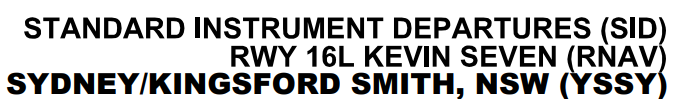

--8<-- "includes/abbreviations.md"

## Background
Pilots of IFR aircraft must ensure they remain a safe altitude above any obstacles or terrain during the departure phase of flight, until they reach the MSA/LSALT. Multiple departure procedures and methods are available, and it is the pilot's responsibility to select the most appropriate one.

## Standard Instrument Departures (SIDs)
A SID is a charted procedure which directs the aircraft along a surveyed path. They ensure terrain & obstacle clearance and will often have some form of traffic or airspace separation built in, particularly when used around busy, controlled aerodromes.

SIDs are generally defined for controlled aerodromes, providing terrain & obstacle clearance, segregated traffic corridors, and airspace containment. They are also available at some uncontrolled aerodromes, providing terrain & obstacle clearance and sometimes providing a path clear of surrounding SUA.

Height and speed restrictions may be present on different procedures to ensure that aircraft remain within the surveyed track. These must be complied with in CTA unless ATC explicitly cancels them.

### Transitions
At some locations, a single SID procedure can terminate at various positions. In these situations, each terminating waypoint is defined as a *transition*. When ATC issue an airways clearance which includes the use of the SID, the applicable transition will be specified. It is important that the correct transition is selected in your aircraft's FMS/GPS.

Procedures which terminate at a single waypoint do not specify a transition.

### Procedural SIDs
Procedural SIDs instruct pilots to track to a variety of waypoints, intersections, and other positions, with little input from ATS. In Australia, procedural SIDs generally require an area navigation system and are labelled as *RNAV* SIDs.

<figure markdown> 
  { width="500" }
  <figcaption>Procedural SID Title</figcaption>
</figure>

!!! note
    Some **procedural** SIDs have **radar** transitions, from which pilots will receive vectors or other tracking instructions from ATS. These should not be confused with [Radar SIDs](#radar-sids).

### Radar SIDs
Radar SIDs provide initial tracking instructions until a given altitude or position, then instruct pilots to comply with their assigned departure instructions. In Australia, radar SIDs are labelled with the *RADAR* qualifier.

<figure markdown> 
  { width="500" }
  <figcaption>Radar SID Title</figcaption>
</figure>

Departure instructions may take the form of an *assigned heading* (which should be flown **uncorrected** for wind) or an *assigned track* (which should be flown **corrected** for wind).

!!! warning "Important"
    Pilots must not commence their takeoff roll when assigned a radar SID unless they have received their departure instructions.

!!! phraseology
    **SY ADC**: "RXA6166, assigned heading left 230, runway 34L, cleared for takeoff"  
    **RXA6166**: "Assigned heading left 230, runway 34L, cleared for takeoff, RXA6166"

## Visual Departures
When visual by day, pilots may elect (or be instructed) to depart visually. In this case, no SID will be issued with an airways clearance. Instead, the pilot will be instructed to make a left or right turn with their takeoff clearance.

!!! phraseology
    **CFS ADC**: "QLK106D, runway 21, cleared for takeoff, make left turn"  
    **QLK106D**: "Runway 21, cleared for takeoff, make left turn, QLK106D"

Pilots should climb to a safe altitude (generally 500ft AGL), then commence a turn as instructed by ATC and **intercept** their outbound track. When operating OCTA, pilots should generally depart via a leg of the standard circuit.

## Other Departure Methods
During times where a visual departure is not suitable but no SIDs are published for a particular aerodrome, pilots must depart in an appropriate way to ensure terrain & obstacle clearance.

### Published Company Procedures
Whilst hard to come by on VATSIM, in the real world, some operators publish climb procedures to be used by crew when departing at night or in bad weather. In CTA, a clearance must be obtained to track via these procedures.

!!! tip
    As ATC does not have access to these company procedures, ensure that you describe how you wish to track in detail, to give controllers a good understanding of your intentions and issue a clearance as such.

### Climb in the Circling Area
The [circling area](./iaps.md#circling-areas) is a surveyed area surrounding each usable runway which provides pilots with terrain & obstacle clearance below the MSA. Pilots may elect to circle inside the circling area on climb to the MSA, then depart on track where a visual departure is not suitable.

### Engine Out Procedures
Specific engine out departure procedures are available for most runways and used in the real world to ensure terrain & obstacle clearance in the event of an engine failure during the takeoff or departure phase. Pilots may elect to remain on their cleared SID or fly the published single engine procedure, informing ATC as soon as practical. These procedures can often be found alongside your generated takeoff performance data.