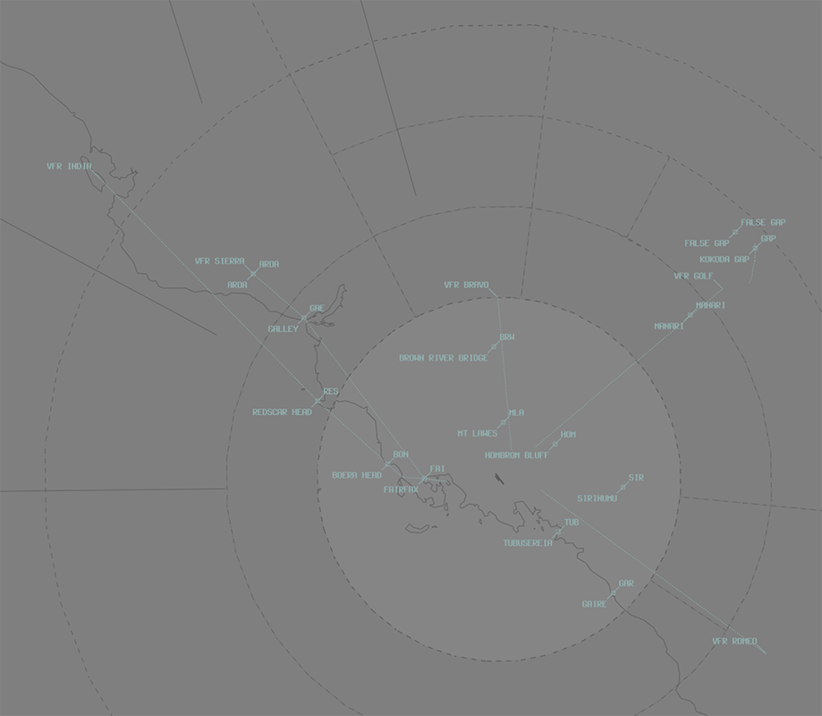

--8<-- "includes/abbreviations.md"

## Runway Modes
The preferred runway is **Runway 14L** for departures and arrivals, however aircraft lighter than 23,000kg MTOW can take **Runway 14R**. When these conditions are not met

- Tailwind less than **5 kts**; and
- **By day**; and
- in **VMC**; and
- the runway is **dry**.

**Runway32R** shall be used.

### Departure Procedures
IFR Aircraft should plan via **GUNKI**, **LOTGU**, **NUPTA**, **ODOGA**, **RUVKI**, **STARF**, **TOMOM** or **UNSAM** to recieve a procedural sid.

## Arrivals
IFR aircraft should plan to arrive **Runway14L/32R** due to its ILS and RNAV capabilities.

## VFR Operations
### Departure/Arrival Gates
Aircraft should report at the standard VFR Departure/Arrival Gates.

<figure markdown>
{ width="500" }
  <figcaption>AYPY VFR Departure/Arrival Gates</figcaption>
</figure>

| Direction from AYPY | Code | Name | Dep/Arr |
| ------------------- | ---- | ---- | ------- |
| North | BRW | Brown River Bridge | Both |
| North | MLA | Mt Lawes | Both |
| Northeast | - | False Gap | Both |
| Northeast | GAP | Kokoda Gap | Both |
| Northeast | HOM | Hombrom Bluff | Both |
| East | SIR | Sirinumu | Both |
| Southeast | GAR | Gaire | Both |
| Southeast | TUB | Tubusereia | Both |
| West | FAI | Fairfax | Both |
| West | BOH | Boera Head | Both |
| Northwest | RES | Redscar Head | Both |
| Northwest | GAE | Galley | Both |
| Northwest | - | Aroa | Both |

### Inbound/Outbound Routes
| Victor | Inbound | Outbound |
| ------ | ------- | -------- |
| Bravo | Track H174 to Bomana Gaol | Track F357 From Bomana Gaol |
| Golf | Track PY 050 radial inbound | Track PY 050 radial outbound |
| Romeo | Track H316, remaining at least 1nm east of Rigo Road | Track H136, remaining at least 1nm east of Rigo Road |
| India | Aroa-GAE-Gorohu-FAI-Tatana Island | Tatana Island-FAI-Gorohu-GAE-Aroa |
| Sierra | Yule Island-RES-BOH-Porebada-Tatana Island | Tatana Island-Porebada-BOH-RES-Yule Island |